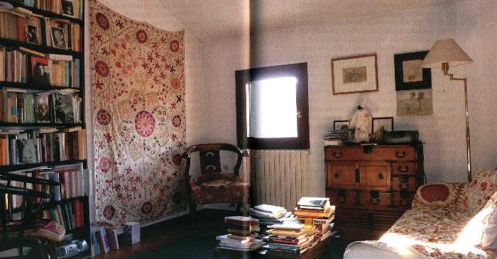

Недавно вышедший [«Автопортрет в кабинете»](https://www.edizioninottetempo.it/it/autoritratto-nello-studio) Агамбена можно было бы понять как попытку «вычитания», чуть ли не феноменологической редукции: давайте расскажем о каком-то философе так, словно бы от него осталось лишь несколько фотографий, или несколько строк — как сделал Мейясу, используя этот искусственный пример для портретирования Делеза, от которого сохранилось всего несколько строк о Бергсоне. Но здесь этот прием быстро разоблачается в качестве именно приема, постепенного о себе забывающего, — уже в силу того, что Агамбен и по сей день в кабинете, из которого описывает себя, того, кто в нем находится, свободно ассоциируя себя с многочисленными вещами и артефактами. Ситуация, в которой кабинет достался бы нам на манер какой-то янтарной комнаты, пирамиды и т.д., заранее исключается: кабинет — это не столько «пирамида» (Гегеля в интерпретации Деррида), сколько, напротив, модернистский механизм прояснения и сохранения, вечно работающий холодильник для любых печений «мадлен», которые только удалось попробовать в этой жизни.

«Пирамида» определяется тем, что в ней, в конечном счете, теряется каждый, в ней погребенный: хотя ее raison d’être именно в том, чтобы не потеряться в потусторонней жизни, она оказывается машиной потери, поскольку демонстрирует невозможность создания последовательного аппарата парсинга и интерпретации, нитей Ариадны произвольной длины и абсолютной крепости. Отсюда и предрассудок «проклятия фараона» или пирамиды, который является не более, чем рационализацией таких невозвратных потерь, издержек, которые захватывают любое суверенное значение: призраки, вырывающиеся из гробниц, — не стражи, а потерявшиеся. Гробница, мавзолей, пирамида — все это способы самосохранения, которые не подходят для современного мобильного интеллектуала, который уже готов оставить память о себе. 

Кабинет — studio — активно оппонирует нескольким выделенным культурным локусам, находясь на перекрестье их эволюционных линий. Одна из задач, которые он решает, — склеить контекст производства с контекстом верификации и признания. В первом пункте, он противостоит унифицированному бюрократическому пространству — офисного труда, университетской аудитории, да даже и библиотеке. Упрочение этих пространств создает вполне модернистский горизонт контрмеры — создать такое замкнутое контрпространство, в котором мыслитель мог бы оставаться наедине с собой и с теми, с которыми он только и желает вступать в коммуникацию. Едва ли не первым делом в меблировке своего кабинета (вернее, одного из кабинетов, а именно того, что остался в прошлом) Агамбен указывает на фотографии с семинара с Хайдеггером 1966 г. в Ле Торе, а также фото знаменитой Hütte в Тодтнауберге. Однако, кабинет — не просто восстановленная мастерская деревенского «мастера» (то есть ремесленника), в которой он год за годом делает что-то, понятное, возможно лишь ему самому (или находящее сбыт исключительно на местном рынке). В кабинетах Агамбена чрезвычайно много даже не книг (они почти не описываются), а фотографий, рамок с заключенными в них рисунками или рукописями, тетрадей и т.п. Все это обилие знаков различных знакомств само, однако, уже зафиксировано как репрезентация — Агамбен говорит в основном о старых кабинетах, от которых остались фотографии (а также сами артефакты, которые курсируют из одного кабинета в другой). Таким образом, один кабинет фотографируется, а фотография переносится вслед за мигрирующим владельцем в следующий кабинет. После та же процедура повторяется снова, создавая хорошо узнаваемую фигуру en abîme. Агамбен, однако, ни разу не упоминает об этой геральдической репрезентации, и подсчитать количество кабинетов оказывается не так-то просто (видимо, около четырех, включая тот, в котором он работает в настоящее время). Производственная репрезентация становится неотличимой от легитимации: фотография Хайдеггера призвана одновременно организовывать мышление самого Агамбена (конечно, не сейчас, а в далекие 60-е), но затем, превратившись в фотографию фотографии, она уже просто свидетельствует о легитимности владельца кабинета и его занятий. Таким образом, с одной стороны, кабинет должен наполняться множеством стикеров, post-its, но, с другой, последние должны превращаться в нечто уже обрамленное рамкой (Агамбен с Хайдеггером, он же с Пазолини, он же с Хосе Бергамином и т.д. — не становится ли в конечном счете он кем-то вроде Зелига у Вуди Аллена или Фореста Гампа?). Кабинет — это место, где стикеры постепенно приобретают ауру.

Соответственно, кабинет — это, конечно, не хижина Хайдеггера, не место ремесленного, аутентичного и независимого в своей мифичности производства (как, впрочем, не была им в полной мере и хижина). Напротив, собственно «производство» в значительной мере вынесено из него, чтобы заменяться накоплением и аранжировкой одновременно личных и публичных знаков и репрезентаций, отчасти превращающих (чего опасается сам автор, p. 42) кабинет в музей. Второй кабинет Агамбена (в переулке Джильо в Риме — почти что «Жилье») передается ему, что специально оговаривается, художником Рамоном Гайя, который даже оставил там мольберт с незаконченной картиной. Первый кабинет, куда Агамбен въехал еще до этого, принадлежал неназванному писателю (не указывается, не осталось ли от последнего незаконченной рукописи). Эта незаконченная картина, по словам Агамбена, так и оставшаяся в кабинете, указывает одновременно на своего рода прерывание простого ремесленного процесса и наследование, вписанное уже в простейший акт съем жилплощади (разумеется, в этом мире нет риелтеров и нежилых помещений, снимаемых под офис, по крайней мере о нем ничего не говорится). Незаконченная картина, по признанию автора, продолжается в его собственной любви к живописи, но и, разумеется, в его собственных текстах (не только о живописи), символически подписываемых, таким образом, даже не автором, а незаконченным мазком кисти, плавно переходящим во вполне законченный росчерк пера. Кабинет снимается сразу «с культурой», со всеми означающими под ключ, как нельзя более удачно создаваемыми прерыванием натурального, мастерового процесса и его сублимацией в виде вечно живого, незаконченного полотна, оставшегося на мольберте в виде своего рода инсталляции (алтаря?), поддерживающей настроение автора.

Конечно, другая противоположность кабинета — это уже не мастерская художника и не хижина, а собственно публичное пространство, officio. Агамбен создает готовый к увековечиванию автопортрет, по сути рассказывает историю своей жизни, из которой симптоматически исключены почти все официальные детали, которые, собственно, и могли бы говорить как о реальном производстве (что писалось, как, в каких условиях?), так и о реальном признании и продвижении (где начал работать, на какой кафедре, в каком кабинете?). Officio — даже больший враг кабинета, чем мастерская, поскольку последняя облагораживается и возносится, тогда как офис просто исключается. Кабинет нельзя «получить» от безличного университетского начальства, соответственно, мы ничего не узнаем о кабинете Агамбена по месту работы. Настоящий кабинет достается от друзей-художников или писателей, которые уже успели его обжить, обставить необходимыми культурными знаками, вернее самими собой, своими следами (интересно, что такие художники неизбежно исчезают где-то в пучине гражданской войны). «Офиса» не существует даже в промежутках и в поисках, но такое исключение сказывается и на самом кабинете — современный кабинет почти не описывается, а как работал Агамбен в своих старых — тоже непонятно. Вместе с ремесленным производством исключается и официальное формальное производство, так что артефакты «реального» движения мысли неизбежно застревают на полпути между (неофициальными) знакомствами или тусовками и (официальной) публикацией. В повествовании много деталей о конкретных знакомых, впечатлений от книг, с авторами которых Агамбен лично знаком не был (Герман Мелвилл, Симона Вейль), рассуждениях о произведениях искусства (в том числе созданных знакомыми и друзьями), но, соответственно, нет ничего ни о личном процессе письма (как, собственно, Агамбен пишет сейчас — возможно, даже без компьютера? как организована рабочая библиотека, а не система автографов?), ни о его официальном завершении.

Кабинет — своего рода символическое одеяло, под которым автор готов провести всю жизнь, детский «штаб» на дереве или, еще, еще лучше, палатка, поставленная непосредственно в квартире и четко отличающее одно пространство от другого. Последний момент особенно заметен — материя палатки настолько непроницаема, что мы ничего не узнаем о том, с чем, собственно, соседствовали кабинеты, с какими комнатами, где Агамбен жил, когда там жил (непосредственно в кабинете — но это вряд ли, рядом в другой комнате, в другой квартире, этажом выше и т.п., какой, собственно, жилплощадью он был обеспечен?). «Квартира» и даже дом совершенно экстериорны кабинету — а потому не приводится ни одной планировки «студии» с указанием метража (что было бы совсем нелишне, хотя фотографии кабинетов не производят впечатление большого пространства), и есть разве что несколько карт, указывающих, как именно автор обычно перемещался по Риму. Точно так же исключены и все намеки на кухни, коридоры, ванные комнаты, кладовки и т.п. — описанию подлежит даже не «жилая площадь» (вычитаемая из «общей»), а территория «под палаткой» (включенная, однако, в большой палаточный лагерь), которая в то же время является комнатой подростка — здесь развешаны фотографии философских знаменитостей, там — кое-какие артефакты, на столе разложены немногочисленные тетради, во всем царит легкий, но очень умеренный бардак, лишь предвещающий бурное творчество, но совершенно не обязательно его гарантирующий. 

Большая, но в то же время компактная, обозримая, умещающаяся на нескольких фотографиях тусовка (тот самый le monde, где еще Декарт намеревался узнать истину), существует в виде такого диахронического палаточного лагеря, кемпинга, в котором кабинеты — лишь одни из артефактов, передаваемых из рук в руки. Конструкция «кабинета» Агамбена, разумеется, отсылает не к личному, не к жилищной, бытовой или даже трудовой истории автора, а к определенной форме, создаваемой и удерживаемой многими модернистскими авторами, но в настоящее время практически уничтоженной официальностью и мобильностью. Предки кабинета Агамбена — это, например, обитая пробкой комната Пруста (ныне музеифицирована) или же квартиры, в которых Джойс жил в Париже. Это уже не поместья и не усадьбы, но, конечно, и не гостиничные номера, офисы или «резиденции поэтов» в современном смысле. Кабинет работает на двойном эффекте: уединения и открытия, то есть это своего рода рубка или ставка, из которой автор может свободно обозревать весь мир и общаться с другими авторами. В тот момент, когда на производстве уже вполне утвердились реальные кабинеты управляющих, так что кабинет стал, по сути, универсальным обозначением для иерархии социальных мест («ходить по кабинетам», «перемещаться из одного кабинета в другой»), модернистские авторы (и Агамбен как их наследник) создают зеркальную контрмеру — кабинет писателя, все еще — или только сейчас — способный схватывать расширяющийся и дробящийся социальный мир. Конечно, в такой управляемой и заново собираемой экспансии как нельзя более важна практика передачи и хранения артефактов — и кабинет, как их контейнер, ничем от них не отличается. Аура, конечно, создается именно тогда, когда она разрушена, то есть как ретроактивное объяснение ее отсутствия, и именно она позволяет передавать из рук в руки мольберты, незавершенные картины, фотографии и т.д. — все эти вещи, которые принципиально дефицитны и которые только и могут воспроизводить кемпинг, в котором проживает Агамбен.

Штучность артефактов, едва ли не волшебных, в какой-то мере восстанавливает «контекст открытия»: одни артефакты открывают новые, поскольку некоторые всегда уже потеряны. Система сообщающихся (сквозь время и пространство, но в тоже время за счет передачи от одного владельца другому) кабинетов позволяет фильтровать курсирующие по ней записи, рукописи, оттиски и т.п., подбрасывая время от времени жильцам улики, необходимые для более полного восстановления утраченного. Кабинеты и артефакты можно представить в качестве особого распределенного биологического вида, который пользуется услугами гуманитариев — комменсалов или, в лучшем случае, симбионтов. Так, личные знакомства, фильтруемые опять же кабинетами, позволяют Агамбену заняться поисками Беньямина, след которого обнаруживается в переписке Батая. Занятно, что рукописи, которые обнаруживаются по этому следу в «Национальной библиотеке Франции», так же, как и все остальные артефакты, находятся в промежуточном пространстве — не личном, но и не общественном. Эти рукописи вдова Батая отдала Библиотеке на хранение, но, поскольку они не перешли в собственность библиотеки, они так и не были внесены в каталог и даже директор не знал об их существовании, пока по настоянию Агамбена не были предприняты поиски. Подлинные рукописи, разумеется, не должны храниться в официальном архиве — скорее именно в таком промежуточном депозитарии, где они уже перестали быть собственно рукописями, но еще не стали текстом. Найденные чудесным образом бумаги (написанные на французском и немецком) создают такой эффект присутствия, что Агамбену кажется, будто Беньямин «отвел его самого за руку» в те же аудитории, в которых он некогда работал (p. 101). Однако этот эффект присутствия, конечно, не приравнивается к возвращению в «мастерскую», к непосредственному слиянию эпигона (как Агамбен называет самого себя — p. 42) с объектом подражания. «Долг» Агамбена перед Беньямином заключается, прежде всего, в «способности вырывать силой из исторического контекста то, что мне интересно, чтобы оживить его и заставить действовать в настоящем» (p. 103). Эта несколько общая формулировка как нельзя более удачно описывает кабинет — уже вырванные из контекста артефакты и репрезентации, способные бесконечно оживать и направлять по собственному следу. 

Можно было бы, конечно, подумать о том, как «studio» Агамбена может быть реанимирован в мире, где фриланс и надомный труд проецируется в фантазии «студии», малометражной квартиры, доступной едва ли не каждому, кто готов оставаться в этой капсульной вакуоли биологического и социального воспроизводства. Но, конечно, распространение студий в условиях спада потребительского спроса на более крупные жилплощади, говорит лишь о том, что studio все больше остается в прошлом, как и офис или контора. Интеллектуал существует теперь в диалектике не столько офиса и студии, сколько кабинета и стула — вопрос не только в том, какой он кабинет занимает, но и с чьим стулом он пришел. К сожалению, Агамбен ни разу не оговаривает то, на чем именно покоилось его собственное тело во всех этих кабинетах: есть стол, полки с книгами, стена перед столом как поверхность репрезентаций (экран для фотографий), но, собственно, о стульях или креслах речь не идет (это же не мольберт). На одной фотографии видно простенькое офисное кресло, но и только. Стол кажется слишком маленьким и хрупким по сравнению с креслом (тоже далеко не директорским), и, в конце концов непонятно, не занесли ли их из какой-то соседней комнаты, просто на время съемок. Кабинет — это все же то, что сделано для рук и в меньшей мере глаз, сидеть здесь, по сути, незачем, и это понятно, если подумать о том, что ближайший его аналог — мнемотехнический «метод мест», только запоминается здесь не то, что понадобилось владельцу, а сами эти «места» — редкие и единичные, достающиеся от одного другому.