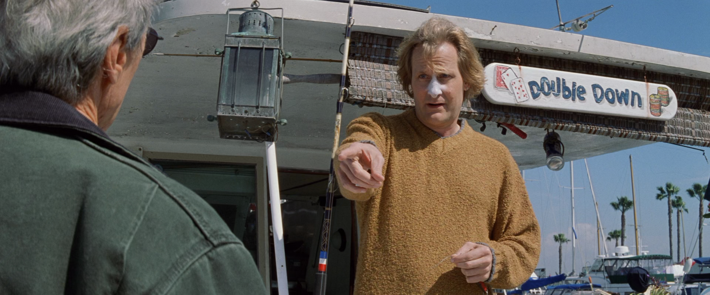

В «Кровавой работе» (2002) Иствуда сюжеты, которые в более позднем/мейнстримном повествовании можно было бы встроить в логику трансрасового и трансгендерного перехода, перегибаются слишком сильно, а потому становятся не вполне удобными для того или иного идеологического применения.

Главному герою МакКалебу (Иствуд), агенту ФБР, пересаживают сердце латиноамериканки, что оказывается поводом не только для насмешек визави-маньяка, вышучивающего его новообретенные, предположительно «женские», черты, но и для претензий на новую расу, которые заранее отвергает латиноамериканский коп. Конечно, Иствуда можно заподозрить в том, что он, словно бы невольно и мимоходом, исказил само направление образцового перехода (из мужчины в женщину, из белого в черного, из белкового в небелковое), лишь закрепив гегемонические позиции главного героя: и правда, он — белый мужчина, готовый умереть от одышки, так что в него даже не нужно стрелять, а потому пересадка сердца выглядит подозрительно опасной парафразой апроприации крови и других животворных жидкостей, отнимаемых у молодежи с другим цветом кожи. Маньяк Джеспер (Дэниэлс), за которым герой Иствуда охотится и который живет у него буквально под боком, оказывается встроен в саму эту позицию гегемона в качестве своего рода сервомеханизма. Содружество белых мужчин представляется заранее предустановленным заговором, в котором они помогают друг другу даже в том случае, когда формально борются. Но сама эта конструкция коммуникации в среде белых оказывается в итоге интенсивнее и сложнее поверхностной кооптации транс-переходов героя Иствуда, пусть он и предвосхищает «Прочь» (Get Out) Джордана Пила, указывая на то, что расы могут понадобиться друг другу в качестве контейнера и содержимого, и тогда весь вопрос в том, кто в кого погружается (цветные в белых в случае Иствуда или, наоборот, белые в цветных в «Прочь», правда, с почти тем же результатом).

В основной линии — перехода между расами и полами — главная оппозиция прочитывается как противопоставление внутреннего и внешнего, поглощения и поглощаемого, того, что остается снаружи, и того, что уходит, инкорпорируясь, внутрь. Базовая привилегия полумертвого копа рисуется как отношение его большего тела к одному органу, пусть и ключевому. Погружение сердца из одного тела в другое, фигурально выражая господство и привилегии одного тела над другим (жертва убивается специально для того, чтобы стать поставщиком органов для МакКалеба, и ни для чего другого), указывает на своего рода предел отношений одной расы или группы к другой: одних можно пустить на органы только потому, что они должны оставаться «внутри», в рамках структуры, которая определяется независимо от того, какие внутри нее органы. Борьба между расами идет не за то, собственно, кто кого переживет, отнимая друг у друга органы, а за то, кто составляет структуру, то есть имеет возможность обходиться без органов, по крайней мере какое-то время, оставаясь на искусственном жизнеобеспечении, поскольку любые органы только и могут быть собой внутри этой структуры, в функциональной связке, доступной лишь белому человеку (поскольку человек — это не органы, не «мясо»). Структурность, статность и хребетность героя Иствуда подана как нельзя более наглядно: он — не столько отставной агент, сколько робокоп, добивающийся справедливости там, где все давно махнули рукой. Однако, его робофикация (киборг — не обязательно механически аугментирован, достаточно добавления чужих органов) уже указывает на определенную слабину, податливость. Робокоп в роли частного сыщика — фигура не столько неумолимой справедливости, сколько расчувствовавшегося пенсионера, разомлевшего от того, что к нему напрямую обратилась сестра жертвы, отставника, решившего стать одиноким рейнджером, что постфактум выдает тайное влияние нового «сердца», которое, выступая свидетельством неоплатного долга, сбивает его с официального пути правосудия (в частности, заставляя выдавать себя за полицейского с настоящим жетоном, которого у него давно нет). Отношения внутреннего и внешнего невозможно представить в виде простой инструментализации: ставка на контроль внутреннего внешним не может быть гарантированной, поскольку остается возможность понимать трансплантацию как заражение, а потому через внешне надежные черты начинают прорываться чуждые мотивы. Обратная ситуация — в более мощной и последовательной кооптации в «Прочь», где вместо потенциально мирного трансрасового перехода сама его идея становится не более, чем поводом для увековечивания белой расы, которая остается собой, даже став черной.

Но этот первый контур — внешнего и внутреннего, с возможным подрывом одного другим — сам встраивается в качестве внутреннего в более общий цикл взаимодействия детектива и маньяка, который, по сути, действует лишь для того, чтобы оставаться в этом взаимодействии, поддерживать его. Т.о. позицию гегемонии задает не столько безусловный выигрыш героя Иствуда, который в конечном счете получает все, чего только мог пожелать — новое сердце, жизнь и даже новую подругу, расово соответствующую его новому сердцу, — сколько асимметричная коммуникация в среде белых друзей, соседей, граждан и т.д. Вместо того, чтобы просто утвердить и одновременно разоблачить первый цикл идеологии, в котором даже чужие органа никогда вашего цвета не изменят, Иствуд вводит второй цикл — не обменов телами, генами, гендерами и органами, а разорванной коммуникации, незавершенность и несостоятельность которой обеспечивает ее продуктивность, возможность подвязать цикл эксплицитных обменов под заговор, в котором состоят даже те, кто борется против него.

Действительно, отношение серийного убийцы и детектива, который пытается его поймать, оказывается отношением адресации, в котором установить связь с соседом и согражданином можно лишь в том случае, если ты уже забрался к нему в дом и знаешь все подробности его жизни, медицинскую карту и личные привычки. Там, где декларативно может существовать только одно отношение — например, хищника и жертвы, сыщика и преступника, — на деле обязательно существуют два, поскольку господствующая логика коммуникации не может допустить сбоя, не может положиться на удачу. Дело даже не в том, что персонаж Дэниэлса — извращенец, гипотетически получающий удовольствие от того, что официально он — добрый, но бессмысленный малый, выпавший, словно Карлсон, из фильма вроде «Тупой и еще тупее», хороший знакомый и сосед МакКалеба, а, скорее, в том, что для устойчивости и долговечности клуба хороших соседей нужно нечто большее хороших отношений, регулярных визитов и т.п. Без этого большего клуб легко может развалиться — расплыться отдельными суденышками, временно стоящими в фильме на приколе, где, собственно, и живет МакКалеб со своим маньяком-убийцей.

Действительно, отношение серийного убийцы и детектива, который пытается его поймать, оказывается отношением адресации, в котором установить связь с соседом и согражданином можно лишь в том случае, если ты уже забрался к нему в дом и знаешь все подробности его жизни, медицинскую карту и личные привычки. Там, где декларативно может существовать только одно отношение — например, хищника и жертвы, сыщика и преступника, — на деле обязательно существуют два, поскольку господствующая логика коммуникации не может допустить сбоя, не может положиться на удачу. Дело даже не в том, что персонаж Дэниэлса — извращенец, гипотетически получающий удовольствие от того, что официально он — добрый, но бессмысленный малый, выпавший, словно Карлсон, из фильма вроде «Тупой и еще тупее», хороший знакомый и сосед МакКалеба, а, скорее, в том, что для устойчивости и долговечности клуба хороших соседей нужно нечто большее хороших отношений, регулярных визитов и т.п. Без этого большего клуб легко может развалиться — расплыться отдельными суденышками, временно стоящими в фильме на приколе, где, собственно, и живет МакКалеб со своим маньяком-убийцей.

Хорошее общество, чтобы коммуникация в нем оставалась надежной, должно чем-то дублироваться, что порождает множество сюжетов разной степени параноидальности (в стиле «Отчаянных домохозяек» или «Стэпфордских жен»). Маньяк доводит эту логику до конца: приятельские отношения возможны лишь потому, что они уже дублируются намного более пристальным вниманием и глубоким проникновением. Адресация сообщений сыщику нужна именно для того, чтобы тот никогда не вываливался в отношения простого соседства, смежности, около/внеположности, лишенные какого-либо сюжета и интриги, то есть она требуется для того именно, чтобы поддерживать ту «связь» и «связность», которую МакКалеб выделяет как главный содержательный момент своей работы в ФБР (в деле все всегда связано, не может быть случайных событий, проникающий в его корпус, в подшивку документов). Основная проблема состоит, таким образом, не в отношении между расами или в переходах, а в неполной консистентности базовой «связи». Разумеется, «Only connect!» (Э.М. Форстер), но, похоже, что эту связь можно и даже необходимо довести до крайнего состояния: послания сыщику, который не может их до конца расшифровать, нужны лишь для того, чтобы он всегда оставался рядом, чтобы его отношение к соседу дублировалось тем отношением, которое он не может прояснить и именно поэтому поддерживает. В том же смысле таинственный Мориарти должен был в итоге оказаться доктором Ватсоном. Хорошая связь — та, что продлевается до бесконечности, а для этого нужен клиффхэнгер, которым и выступает маньяк.

Таким образом, первый цикл «Анализа крови» (Blood Work) — возможная, но принципиально репрессируемая драма различия и угнетения одних рас, классов и т.п. другими, — используется как всего лишь повод, технический прием и трюк для второго цикла, в котором герой Иствуда, первоначально являвшийся наблюдателем-расследователем, становится в буквальном смысле производным от того самого процесса (серии убийств), которые он изучает. Трансгрессия, неизбежно ощущаемая в трансплантации, а потому принимаемая МакКалебом как нечто само собой разумеющееся, указывает на то, что в зазоре между расами могут циркулировать, строго говоря, два формальных медиума, один из которых дозволяется, а другой — находится на грани дозволенного. Первый можно условно назвать «флюидами», а второй — «органами».

Флюиды — это, традиционно, пот, слезы, кровь, энергия, силы, прибавочная стоимость и т.д., то есть все, что может перемещаться в синаптической щели того или иного антагонизма, определяя, собственно, его связность, поскольку кажется, что перенос флюидов оставляет — по крайней мере до поры до времени — участников этого невольного (для одной стороны, но в какой-то мере и для обоих) обмена в их первоначальной, нетронутой форме. Перенос флюидов не только дозволяется, но и поощряется, способствуя общей флюидизации (и, в конечном счете, ауторефлексивной флюидности желаний), тогда как перенос органов запрещается или, по крайней мере, не поощряется. Под органами в данном случае следует понимать не только «телесные» органы, но и вообще любые составные части любого условного единства, ограниченные столь же формальной рамкой, но именно поэтому защищенные от прямого обмена. Органы могут обмениваться флюидами, но не обмениваются самими собой. Обмен флюидами символически выражается в вампиризме, тогда как обмен органов указывает на потенциальный коллапс зомби, и невозмутимость МакКаллеба говорит о том, что, если он и стал зомби, ему это даже на пользу.

Во втором цикле — который сам Джеспер понимает, очевидно, как цикл солидарности, минимальной связности, восстанавливаемой со стороны того, кто давно вышел за границы любого человеческого общества — ставки очевидно выше, а потому и флюиды, и органы становятся всего лишь знаками, нужными для того, чтобы их нельзя было расшифровать. Маньяк — не тот, кто выпадает из любой социальной связи, становясь зверем или, хуже того, вещью, напротив, он-то и есть тот, на ком такая связь проверяется, вернее он сам ее постоянно проверяет. МакКалеб и его начальство не замечают очевидной уловки: если убийства — всего лишь конверты, на которых пишется адрес одного и того же человека, сотрудника ФБР, то, быть может, ему просто не стоило заниматься этим делом? Непрофессионализм МакКаллеба — не столько в том, что ему давно пора на пенсию, сколько в том, что он позволяет себе увлечься одним-единственным делом, которое заточено специально под него (а потому формально он уже его виновник). Выдвигаемое им требование максимальной связности (в его работе нет ничего случайного, и именно этим она хороша, поскольку это истинная противоположность bullshit job) оказывается рискованным для самой его позиции наблюдателя/сыщика, перебором, который, собственно, и позволяет поймать его на крючок: он просто не в состоянии не получить то, что ему адресовано, хотя для этого формально достаточно директивы руководства. В результате количество подтасовок и совпадений оказывается избыточным даже на чисто сюжетном уровне: в конце концов, Джеспер не мог заранее гарантировать то, что сестра убитой женщины обратится к МакКалебу, чтобы он помог ей с расследованием убийства. Связности в сюжете явно больше, чем сам сюжет может официально объяснить.

Однако эта избыточная связность представляется своего рода виртуальным эффектом или прибавочным продуктом усилий, предпринимаемых в основной парой персонажей, — они настолько хорошо и нерушимо связаны друг с другом (что соответствует интенции маньяка, которая сводится к фантазии нерасторжимости), что даже смерть Джеспера оставляет впечатление незавершенности: связь, которую он тщательно поддерживал, не удается оборвать устранением одного из агентов, скорее, она оказывается подвижным ресурсом, удачно обналиченном в вечном МакКалебе, уходящем на последних кадрах в закат, на лодке с молодой женой. Опасные связи белого общества конвертируются, таким образом, в счастливый межрасовый союз, скрепляемый избытком, запасом связности, так что теперь ни крови, ни органов ему не требуется.

(*Опубликовано также в блоге [rohmerbenning](https://teletype.in/@rohmerbenning/bloodwork)*).