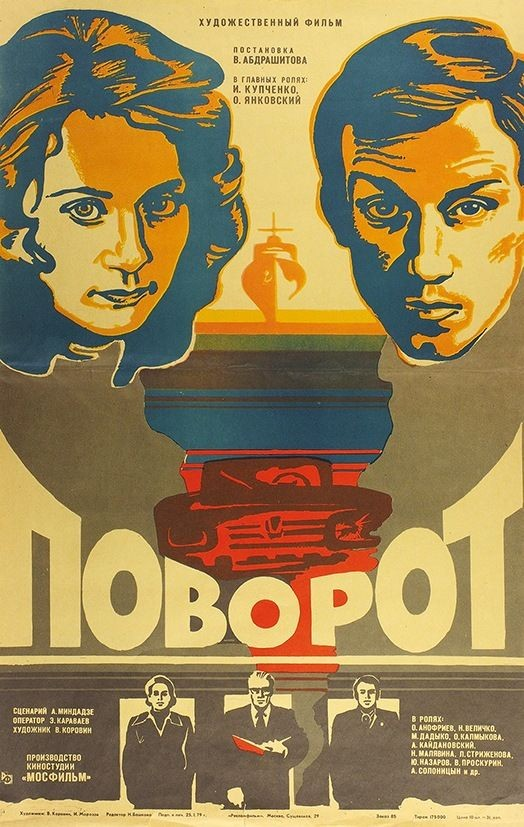

Поворот в одноименном фильме Абдрашитова (1978) совершается скорее метафизический — семейная пара Веденеевых (Янковский-Купченко), возвращаясь на своих «Жигулях» в Москву не просто с югов, но из целого международного морского круиза, едет на самом деле ровно, но из-за кустов, как дикий зверь, выбегает (или просто выходит — в сцене ни зрителю, ни водителю это не особенно видно) старушка, которую сбивает автомобиль.

Поначалу все указывает на то, что автомобиль движется не только в горизонтали, но и в вертикали — Веденеевы путешествуют на морском судне с собственным автомобилем, который в порту нужно снять при помощи специального крана. Машина долго парит в воздухе, территориализируясь на причале, чтобы потом постепенно вернуть владельцев в привычную жизнь. Ее легко угадывает случайный попутчик — как выясняется впоследствии, прокурор, который привычно строит сценарий их дальнейших действий: сразу же в Москву, в понедельник на работу. Безотлагательный отъезд домой сопровождается не совсем проясненным эпизодом в стиле зловещего роуд-муви: машина прокурора и его жены, кажется, не желает отставать от машины Веденеевых, которые, поддав газу, стараются оторваться. Контакт между водителями на дороге помечается как нечто избыточное и едва ли законное — но, впрочем, прокурорский автомобиль вскоре уходит в отрыв и скрывается за горизонтом. Но уже около Москвы сцена вольных или невольных гонок повторяется, когда мимо несколько раз проносится один и тот же автомобиль — «Волга» некоего Кобозева (Проскурин), который, как потом станет ясно, считал, что они на самом деле играли в догонялки.

Нормативная индивидуальность движения на автомобильной дороге (каждый едет сам за себя, самостоятельно и автономно), нарушается, таким образом, вольным или невольным, просчитанным или приписанным удвоением: и вот в одном случае приходится отрываться от знакомых, а в другом — тебя уже вписали в игру, которую ты даже не заметил. Это максимально обособленное социальное существование — в лимбе, помеченном специально, с нажимом и жирно, поскольку это пространство (а) между Москвой и морским круизом, глобальными югами в целом, (б) между ночью и днем (сумерки) (г) между работой и отпуском (отпуск закончился, но работа только в понедельник). Но оно нарушается нежеланным ангажементом, пределом которого становится неожиданно оказавшаяся на проезжей части старушка. Моментально образовавшаяся толпа и едва ли не драка лишь подтверждают то, что остаться в этом лимбе не получится.

Старушка, разумеется, нарушает глобальную линию движения автомобиля Веденеевых — от морского турне до дожидающейся дома докторской диссертации — вполне трагедийно, как рок, поджидавший счастливую, но усталую пару. Но весь дальнейший сюжет — неудачная попытка вписаться в эту трагедию, понять ее законы, которые, вроде бы самоочевидны. Сам Веденеев, похоже, слишком спешит поверить в то, что в облике старушки на дорогу вышла его собственная судьба, а потому все действия практического характера совершает, скорее, под нажимом жены, придумывающей в качестве главного стимула мнимую беременность. Однако трагедия не складывается, неудачные совпадения не столько развиваются, сколько нейтрализуются. Прокурор, с которым они познакомились в круизе, отказывается помочь (ни единого намека на возможную коррупцию), но это ничего не значит. Веденеев переоценивает судьбу, сами ее потенции в позднесоветском пространстве, не замечая того, что подтверждает даже врач: да, авария повлияла на старушку и ее смерть, но все дело в возрасте, а на него автомобиль не влияет. В итоге столкновение оказывается во многом таким же фиктивным, как и «игра» с параллельно двигающейся «Волгой» — то ли столкновение что-то решило, то ли нет. Причины, факторы и влияния, похоже, только и ждут, что судьба приложит к ним руку и расставит по местам, но ее хватило только на случайное движение пожилой женщины, которая выбегает как олень на трассу. Веденеев — единственный, кто верит в то, что это определяющее событие, которое можно свести к простейшему уравнению смерти и расплаты. Он планомерно готовится к тюрьме — по сути к собственным похоронам — прощается с матерью, отказывается от защиты диссертации, только что завещание не пишет.

Саундтрек Владимира Мартынова, сильно напоминающий музыку в джалло, подчеркивает то, что «агентность» куда-то все время ускользает — неясно, что делала в сумеречный час старуха на трассе, почему ее отпустили одну, если вся семья знала о ее плохом зрении. Нагнетание напряжения — столкновение с родственниками, истерики жены — говорит о том, что может произойти событие, аналогичное начальному, но оно не происходит. Долгое вглядывание в фотоальбом погибшей не позволяет герою увидеть в ней себя. В конечном счете, даже поиски выгодного свидетеля, увенчавшиеся успехом (сын Константин — Солоницын — подтверждает слабость зрения матери, но за свои свидетельские показания спешит поиздеваться над Веденеевыми) — ничего особенного не дают. Суд проходит формально, где-то на границе сознания, по своей, чисто процессуальной логике (старушка сама нарушила правила движения и создала аварийную ситуацию), которая оправдывает Веденеева, отменяя все его приготовления к судьбе. Фатальные стратегии не оправдываются. В последней сцене супруги замирают в телефонной будке, позвонив курирующему главного героя академику и перезапустив собственную социальную жизнь — диссертация возвращается, а с ней и все остальное.

(*Опубликовано также в блоге [rohmerbenning](https://teletype.in/@rohmerbenning/kzGABIjxZ)*).