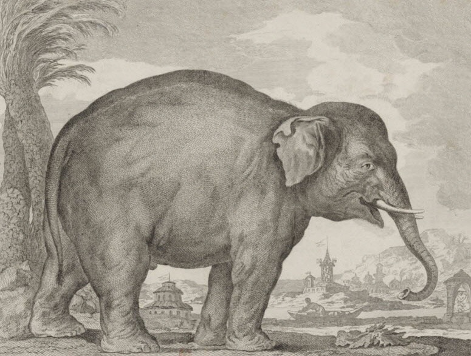

Теоретики экологии — и Мортон — говорят, что разнообразие заведомо лучше однообразия, поскольку это, прежде всего, эстетический феномен. Разнообразие радует глаз. Однако, не вполне понятно, как отделить такую радость глаза от собственно агрологики и агрологистики, которая является ее залогом. Оптическим аналогом разнообразия является пестрота, которая, в свою очередь, выступает одним из основных качеств демократического устройства, которое в греческом варианте отсылало, как известно, к автохтонам, обрабатывающим свою землю и из нее же выходящим (греки - это некая помесь пшеницы и дождевых червей). Радость глаза — не нечто исключенное логистикой, скорее ее следствие и коррелят.

Базовым вариантом такого включения оптического удовольствия в саму когнитивную схему воспроизводства и урегулирования «того же самого» является, конечно, тщательно затушевываемый пример Ноя, который, будучи образцовым агентом еврейской агрологистики, оказывается единственным мифологическим героем биоразнообразия. Если предпологать, что агрологистика — это монотеизм, то есть логика, нацеленная на уплощение и воспроизводство того же самого, в перспективе и промышленными методами, то есть некий теологический фордизм и даже теологическая машина Тьюринга, не вполне понятно, почему другие античные нарративы не создали героев собственно биоразнообразия — почему, например, нет греческих богов, которые бы отвечали именно за спасение множеств (хотя, разумеется, существуют боги плодородия, но это совсем другое). Почему в них нет своих Ноев и дедов Мазаев (или Моисеев)?

(*Рисунок Л.-Ж. Ватто, после 1770 г.*)

Разгадка в том, что ковчег Ноя — это именно машина радования глаза и одновременно сохранения разнообразия, которое само выступает априорным условием любого упорядоченного воспроизводства. Когда Кант говорит о многообразии, это, по сути, тот же ковчег, который продолжает плыть на кромке трансцендентального сознания, однако это совершенно не значит, что оно его как-то вытесняет или топит. Дело в том, что воспроизводство того же самого не обязательно означает воспроизводство чистой линии, единственного штамма, устойчивого ко всему на свете, с таким же успехом оно — в более рефлексивном варианте — оказывается сохранением всего подряд, и нужного, и ненужного, поскольку в своем предельном отвращении к риску оно неотличимо от хординга. Сама идея онтологистики (или даже логики как таковой) основана на том, что можно гипотетически разделить то, что нужно сохранить, в чашке Петри или в логическом силлогизме, который передает одну посылку до другой, нисколько ее не меняя, и то, что нужно отсеять. Логика, разумеется, решает этот вопрос путем простого вынесения за скобки (что-то как-то отсеялось, осадилось в чистую линию и чашку Петри еще до того, как логический аппарат начал работать), тогда как любая реальная логистика на это не способна. Логистика превращается в силлогистику или, вернее, в силлогоманию (официальное название hoarding’а — от syllogos), то есть в рефлексивное удвоение логоса (как собирания), или же в рефлексию логоса в силос. Рефлексия логоса в силос не может ограничиваться гладким воспроизводством одного и того же не потому, что этому воспроизводству мешают какие-то внешние силы или катастрофы, а потому что сам концепт сохранения подвешен на неустойчивую процедуру отбора сохраняемого и несохраняемого, сортировки, которую невозможно обеспечить в рамках той логики, которая требует сохранения всего того, что должно так или иначе ограничивать риск. Соответственно, сортировка в такой модели осмысляется на втором шаге как всего лишь вынужденная мера, то есть следствие ограниченных ресурсов, уступка, которая делается по внеконцептуальным причинам, а потому, как только такие причины аннулируются или преодолеваются, сохранение коллапсирует в силлогоманию, а логос в силос.

Однако такая рефлексия логоса сама по себе глаз не радует — более того, она вызывает, скорее отвращение именно потому, что в ней на поверхность выходит не что иное, как невозможность отличить собирание (животных, племен, народов и т.д.) от хординга (и в этом смысле в Федорове опознается фрик, а в его теории - обычная crackpot theory, именно потому, что в нем проглядывает эта фигура хординга, метафизического Плюшкина, который желает прибрать все к рукам, сохранив последнюю пустышку). Глаз радуется исключительно в невозможном фокусе воображаемой реализации отсеивания, то есть такого многообразия, которое еще не пережило катастрофы собственного избытка. Идеальное отсеивание совершается путем затирания, пропуска сортировки — точно так животные приходят на ковчег своим путем, своими ногами, тогда как те, что не пришли, признаются неявившимися. Все должно разобраться само собой. Соответственно, потоп, который переживает Ной, — не внешняя стихия, а следствие его собственной логики, затопление сохранением и сохранностью, тогда как ковчег выступает идеальным сортировочным аппаратом, который достигает невозможного: четкого отделения того, что требуется сохранить в перспективе рисков, причем основным риском является, опять же, не внешние «неизвестные», а риск, присущий самому сохранению, риск компульсивности и всеядности. Разумеется, такая сортировка возможна только в бездействующем аппарате, то есть аппарате без подвижных частей. Т.о. ковчег оказывается идеальным рефлексивным механизмом, который рефлексирует свой собственный риск хординга, препятствуя рефлексии логоса в силос. Иными словами, это не столько биобанк, сколько галерея, музей, поскольку — опять же в духе космизма — галерея является все тем же самым невозможным устройством «предела», той самой границы, которая отличает сохраняемое от несохраняемого, трансцендентальным устройством, которое позволяет решать концептуально невозможные задачи.

Соответственно, и у Канта есть как минимум два многообразия — одно уже загружено на ковчег, а другое, скорее, представляет собой трансцендентального Плюшкина, с которым не так просто справиться. Многообразие чистого разума — это то многообразие, которое не может полностью осваиваться какими угодно трансцендентальными средствами, это скорее пока еще силос-логос. Ковчег, который плывет по границе трансцендентального сознания, - это не Ноев ковчег в его каноническом виде, а скорее ковчег, превратившийся в Летучего голландца, сбой сохранения, неотличимый от его полного завершения.