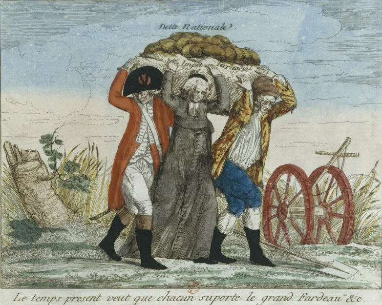

### Все в долгах

Концептуальная ситуация в «Долге» Грэбера показывает проблематичность выхода за пределы схематики плохого обмена/хорошего или нулевого обмена и обычного (денежного, кредитного и т.п.). Отправная диспозиция может показаться действительно решающей — надо показать то, что «долг» или кредит не является чем-то производным от бартера, потребовавшего в свою очередь, денег (как это представляется в стандартном мифе economics), что он, по сути, основывает все экономические отношения, еще avant la lettre. Но это лишь видимая часть проблемы, или полемическая прокси-проблема, которая вводится лишь для того, чтобы указать на совершенно иную, а именно обнаружение такой инстанции avant la lettre, когда отсутствие экономики означало бы и отсутствие обмена как той потенциально опасной точки, с которой начинается то или иное падение (в руссоистском смысле).

Задача эта оказывается невыполнимой, поскольку, очевидно, отсутствие обмена — это не «реальное» отсутствие, а своего рода невозможный аттрактор или нулевая степень обмена, которая тут же воспроизводит классическую проблему: что именно разделяет два типа обмена — благотворного и болезнетворного, позитивного и негативного, какое именно минимальное движение, «прикосновение» (в терминах Руссо и Деррида) привело к тому, что обмен стал нам известен именно в тех формах, которые не скрывают своей патологии?

Разумеется, не находясь в той позиции, в которой можно было бы признать философский дискурс «о даре» (в варианте Деррида или Мариона), Грэбер вынужден все время сдвигать позицию «человеческой экономики», то есть экономики без собственно инстанции экономики, все дальше в прошлое, в каковом она, однако, не может обойтись без того или иного «обмена». Более того, такой обмен может быть даже «хуже» того, что что известен нам сегодня.

Реконструкция долга показывает, что ресурсов для неэкономной экономики не так много, как хотелось бы: разумеется, есть «коммунизм», однако он существует лишь в маргинальной форме. По сути, это всегда сообщество на краю нужды или выживания (в частности, в виде религиозной секты). Или, что то же самое, сообщество, которое перешло в постоянный режим такого выживания, а потому не нуждается во внутренней игре престижа, статуса, да и по сути обмена как такового. Иначе говоря, устранить экономический обмен можно только вместе с символическим. Что интересно, Грэбер весьма скудно описывает такие «коммунистические» общества (с каждого по возможностям, каждому по потребностям»), поскольку в реальности они вряд ли могут предстать сколько-нибудь привлекательным идеалом. То есть «руссоистский» идеал, если и возможен, не имеет ничего общего с воображаемым Руссо: ключевой момент состоит в том, что «потребности» сами калькулируются на уровне сообщества (а не, разумеется, «каждым» его членом, поскольку тут еще нет «каждого»). В ситуации совместной охоты вам, вероятно, не дадут умереть в таком обществе от голода, однако, как подчеркивает сам Грэбер, слишком успешные охотники всегда под вопросом, то есть здесь главное — не высовываться. Коммунистические общества выработали успешные способы загонять их на общий уровень, то есть способы уравниловки, которые не позволяют перейти к «обмену» в той или иной его форме.

Соответственно, можно поставить вопрос, действительно ли такие общества являются отправной точкой, или же это что-то вроде реактивных образований, возникших в ответ на вполне понятные опасности символического обмена, которые, часто, как подчеркивает сам Грэбер, преследуют подобного рода общества как наваждение. Возможно, это именно что отколовшиеся, протективные группы, своего рода сообщества заговорщиков, которые «знают, что творят другие». Так или иначе, между коммунистическими обществами и всеми остальными не существует прямого контакта, ни эволюционной линии (в том числе и потому, что коммунизм представляется абстрактным механизмом уничтожения власти, тогда как обмен — реальным социальным механизмом).

Истинный антагонизм обнаруживается не между коммунизмом и обменом, а между «человеческой» экономикой и любой другой, причем антагонизм построен именно на том, что провести четкое различие между одним обменом и другим невозможно —эта проблематика соответствует двум типам девственности/невинности у Руссо (в таком случае, если «невинность» как virginité— удел коммунистических обществ, то на долю человеческих экономик остается pucelage, то есть неистинная невинность, которая, однако, еще не докатилась до разврата меновых экономик). Собственно, человеческие экономики определяются двумя моментами — отсутствием единого средства платежа и статусом «человека» как одновременно и менялы, и предмета обмена. Человечность такой системы остается довольно сомнительной — здесь буквально нечем меняться, кроме как людьми (женами, подопечными, рабами и т.п.), но, помимо этого, любой обмен требует определенной «смазки», которую и выполняют традиционные «деньги», которые деньгами, разумеется, не являются. Соответственно, люди-как-деньги с самого начала конкурируют с любыми другими деньгами (и в этом Грэбер убедителен: своего рода трансцендентальной схемой «денег как денег» становятся в конечном счете абстрагированные люди, то есть рабы). Обычные «человеческие деньги» (противопоставляемые будущему всеобщему эквиваленту) выступают способом установления контакта и лишь отчасти — способом калькуляции кредитов. То есть это общество, которое коррумпировано: здесь нельзя что-то купить или получить просто так, если ты не знаком с нужными людьми (однако на практике ты так или иначе с ними знаком, хотя от этого не легче).

Таким образом, «человеческие экономики» — лишь одна, не слишком устойчивая опция, в генеалогии обмена, которую Грэбер, однако, не хочет рассматривать в качестве автономной генеалогии, своего рода «филума» (что понятно). Но ясно, что, если немного докрутить ту же логику, получается, что существует общее пространство обмена, в котором есть три координаты — обменивающиеся, обмениваемое, инструменты обмена (или подсчета). То есть люди могут обмениваться людьми, но не только (товарами, знаками признания и т.п.), используя в качестве инструментов обмена людей или же какие-то виды денег (символические деньги, абстрактные деньги). Проблема денег — это проблема омонимии (символические деньги не имеют прямого генеалогического отношения к абстрактным или монетарным деньгам), тогда как сама эта омонимия и путаница возникает из-за своего рода перенасыщения «человеческой экономики» человечностью: люди обмениваются людьми, подсчитывая свои обмены людьми же. Здесь буквально слишком много людей, схема запружена ими. Частично проблему перенасыщения человечностью человеческие экономики решают за счет символических знаков, токенов, возникающих на вакантном месте человека, то есть таких означающих, которые говорят о том, что тут должен был быть человек, но его пока нет. Главный тезис Росбапе, который подхватывает Грэбер — о том, что символические «деньги» (латунные трубки, раковины и т.п.) обозначают не эквиваленцию, а, наоборот, неэквиваленцию, то есть не обмен, а остановившийся, невозможный обмен (поскольку человек не может обмениваться ни на что, даже на другого человека, однако обмениваться людьми все же приходится), — представляется несколько более многозначным, чем представляет Грэбер: если латунные трубки — это напоминание о том, что обмен невозможен, однако он состоялся, сам токен такого неуспеха неизбежно оказывается в положении заместителя, что уже создает возможность для торговли. Грубо говоря, антропологический вопрос в том, что именно делают туземцы: обмениваются дочерями и слугами или просто «делают вид», что обмениваются. 

Возможно, что примитивные сообщества со своими символическими деньгами попали в вариант ловушки «non dupes errent»: они только делали вид, что не могли обмениваться людьми, тогда как на самом деле менялись ими, сохраняя, для пришлых этнографов, хорошую мину при плохой игре: «да, мы понимаем, что меняться женщинами — нехорошо и невозможно, но мы на самом деле и не меняемся! Вы все неправильно поняли!».

Соответственно, вопрос «насилия», на которое напирает Грэбер (деньги и рабы — или деньги-рабы — появились из-за насилия), оказывается нерелевантным, да и по сути, схема объяснения через насилие слишком метафизична (апеллируя, опять же, к руссоистскому сдвигу орбиты, которое запускает иной путь движения). Этот идеологический акцент на насилии приводит к несколько парадоксальной картине. С одной стороны, человеческие экономики могли быть довольно жестокими (например, женщина выдавалась за «призрака» убитого, а ее дети официально становились детьми мертвеца; старики могли накапливать жен, тогда как молодые были вынуждены объединяться в своего рода «мальчишники»). С другой, все это насилие — «не то насилие», не насилие, ведущее к монетарному обмену, а для «того» всегда требуется какое-то внешнее вмешательство, сдвиг орбиты, exorbitant, например, европейское вмешательство, которое создает угрозу настоящего монетарного рынка, продавливающего местные символические рынки. Однако вопрос в том, чем одно насилие лучше «другого», и, что еще важнее, не существует ли некоторой системы перевода одного насилия в другое — то есть насколько насилие может качественно различаться и что означало бы такое различие.

Разумеется, сам Грэбер неявно предполагает, что в человеческой экономике нельзя было «попутать берега», чем как раз и занимались пришлые колонизаторы-европейцы (а потом американцы). Это, однако, заставляет скрыть связь обмена (даже предельно человеческого) с насилием, а потому и выстроить метафизическую оппозицию обмена-которым-не-обмениваются и собственно-обмена. Вообще говоря, отсылка к насилию сама всегда перформативна, то есть объяснение насилием само является примером дискурсивного насилия. Если что-то требуется объяснить насилием — налицо дискурсивное провисание, то есть насилие выполняет функцию fix, и особенно интересно то, что такая фикса далее у Грэбера обычно никак не проясняется — характерным качеством дискурса анархизма оказывается, видимо, фиксация на насилии как предельном объяснительном механизме, который работает на двух уровнях сразу — объекта и дискурса. Между тем, излагаемая история этому может противоречить — например, предположим вместе с историками, что грабеж и разработка Нового Света стали возможными потому, что в Китае резко вырос спрос на серебро (в противном случае экспедиции в Америку стали бы нерентабельны). Незаметно для себя Грэбер снова сталкивается с проблемой монетарности — если деньги имеют, прежде всего, кредитный характер, тогда как символические деньги (бусы, латунные трубки и т.п.) выступали способом опосредовать личные отношения и статусы, тогда не странно ли то, что серебро стало универсальным commodity, которое одинаково добывалось и ценилось и в Китае, и у ацтеков? Грубо говоря, откуда ацтеки могли знать, что их серебро понадобится в Китае? Не раз утвердив то, что денег как чего-то «одного» не существует (за ними скрывается многообразие кредитных и статусных систем), Грэбер сталкивается с суровой реальностью одного металла, который только ждал того, как найти способ транспортировки из Америки в Китай (каковая транспортировка и погубила в итоге Америку). Начав с «человеческих» обществ, которые человечны потому, что собственной солидарностью они контролируют все, что в них происходит, мы неожиданно возвращаемся к агентности металла, у которого свои виды на человечество — в точности как в антропоценных постисториях, центрированных на ружья, углерод и т.п. Выделение металла как отдельной сущности эквивалентно полаганию насилия как объяснительного механизма, который далее расшифровке не поддается.

### Письмо и crackpot theory
[Критиковать Грэбера](https://logosjournal.ru/upload/iblock/4bc/Logos%203-2022-167-183.pdf) несложно, но можно предположить, что некоторая бардачность его текстов сама построена из утопической точки анархического письма, в котором просто не будет ресурсов современной академии, основанной на привилегиях доступов. Например, «оригинальной» аргументации в «Долге» — самое большее на сотню страниц, а остальная часть представляет собой более или менее гладкую компиляцию. Но что если opus magnum в условиях анархизма может быть только такой компиляцией или даже плагиатом? Это уже указывает на омонимию плагиата: в обычном случае имеется в виду простое административное производство, которое заполняется тем, что есть. Но в другом плагиат скрывает за собой логику желания: копируется именно то, что хочется скопировать, хотя такой ход в первом режиме плагиата недопустим (разумеется, герои диссернета копировали не то, что им «хотелось», такой опции для них просто нет). То есть конфликт всегда между двумя формами плагиата, а не между плагиатом и воображаемым auteur, который способен производить что бы то ни было с нуля. Очевидно, что плагиат желания оказался полностью уничтожен «немаркированным», обычным плагиатом, а потому последний утвердился в качестве bête noire для всех и каждого (как анти-ценность, разделяемая не только научным сообществом, но и практически всем).

Грэбер неявно ставит вопрос о том, что стандартное академическое письмо, претендующее на оригинальность, независимость, самостоятельность и т.п., по сути, всегда остается мелкобуржуазным и не дотягивает до анархистского модуса производства. Что такое автор, как не минимальный собственник собственных средств производства, то есть ИП, владеющий определенными концепциями и темами? Капитализация авторов в условиях цитируемых журналов показала это как нельзя более ясно: ИП вышли на рынок, выпустили свои papers, сами стали stocks. Соответственно, контр-письмо может обращаться не столько к модусу оригинальности, сколько к плагиату: не важно, что именно пишется на коленке, главное, что оно вообще пишется, в качестве отсылки к желанию собрать именно это, а не то. Разумеется, даже такую практику приходится защищать лесом ссылок. 
Это ставит вопрос о таком собственно анархистском способе «производства» знания, который, возможно, всегда вынужден питаться уже наличным корпусом текста, оставаться вторичным — или разыгрываться в коллективном плагиате. Ле Гуин в «Обделенных» не решает главной проблемы: как именно в анархистском обществе могло бы функционировать само знание, если только не в режиме педагогической/традиционной проформы, обучения, любительства и т.п. Анархистское производство и традирование знания неизменно застревает в своеобразном любительском традиционализме, повторении устоявшихся форм, на усвоение которых уходит все свободное время любителя, поскольку профессионалов здесь просто нет и быть не может. То есть это общество непрофессионального ремесленного знания, знания как самоповторения азов в свободное время (все могут немного музицировать, но до авангарда дело не дойдет). Как только у главного героя появляется радикально новая концепция, она тут же обретает свое собственное авторское право, вызывая конфликт с кругами официальных «физиков». Ле Гуин предлагает идеалистическую концепцию тотального распространения знания по «радио», но даже если крутить круглые сутки по телевизору теорию относительности Эйнштейна (что само по себе было бы интересным проектом), она не перестанет быть авторской теорией, и, более того, она, вероятно, может попасть в узус любителей только в режиме популярного изложения или, что уже лучше, фан-теорий (каковыми и была научная фантастика). Возможно, анархистское знание существует только в качестве фанфика к большой Теории (но последняя, как, собственно, и получается у Ле Гуин, должна упасть на нас из космоса).

Соответственно, альтернативой авторской мелкобуржуазной теории оказывается своего рода бессознательный плагиат или — в более оформленном виде — фанфик, то есть гениальный физик Шевек, не зная о том, сочиняет попросту crackpot theory — фанфик-теорию, построенную из обрывков сообщений, плохо усвоенной инопланетной физики (в том числе земной), учебников, написанных на неродном ему языке, и неправильно понятых писем с соседней «луны». У Ле Гуин анархистское производство знания оказалось возможным только в перформативном замыкании: Шевек сочиняет именно ту теорию физики, которую описывает — декларативно — в своем тексте сама Ле Гуин, то есть автором его теории является она, но она не может быть автором физической теории (она не физик, а литератор), а потому ее автором является он, физик-анархист, однако он, как показывается этим замыканием, не может на самом деле придумать ничего, кроме фантастической поделки, которая «теория» лишь на словах. Разумеется, было бы бессмысленно требовать дополнить фикциональное изложение шевековской теории «симультанности» какими-то уравнениями, которые якобы существует и которые физик готов предоставить (но, что интересно, никак не может написать в явном виде). Характерно, что этаблированные физики с другой планеты часто оценивают теории Шевека в качестве «мистики». На самом деле Шевек повторяет все те стандартные топики пара-«теорий», которые хорошо известны читателям научной фантастики: мгновенное перемещение, сосуществование всех отрезков времени друг с другом («вечность»), мистическое озарение vs дискурсивный порядок, и, таким образом, сдвигается к некоей фикциональной точке схождения всех «теорий» как таковых, в которых их ограничения таинственным образом снимаются. Поскольку в анархистском мире Шевека не существует научной фантастики (а литература имеет очень ограниченное и проблемное существование — в виде сатирических пьес, за которые можно поплатиться), он принимает научную фантастику собственного изготовления за искомую теорию.

То есть scifi в анархистской утопии остается — и у Грэбера тоже — исчезающим медиатором, который позволяет не разводить позиции фанфика и «Теории»: теория придумывается за пределами контролирующего механизма самой теории, что и позволяет конверсировать ее в фанфик. Анархизм обещает многообразие, но оно всегда несколько напоминает перебор вариантов в стиле «А что если бы Гарри Поттер перешел на темную сторону силы?». Собственно, «Заря всего» Грэбера — не столько всемирно-историческая теория, сколько выписывание такой неявной фикциональной позиции обращения Большой Теории в фанфик, которая пока только и является местом анархистского производства/оборота знаний. Многообразие форм социальной жизни на «заре цивилизации» само составляется как фанфик к большому нарративу последующей «всемирной истории». Гарри Поттер (или элементарное «сообщество») вступает в самые разные отношения с Драко Малфоем, Гермионой и другими персонажами — но, что интересно, количество опций ограничено, и, в действительности, мы не получаем какой-то принципиально иной картины «зари человечества». Мир «всемирной истории» остается тем же миром, хотя он и может пониматься теперь как многообразная «вселенная» перестановок (это и есть маркер сдвига от теории к crackpot theory — переход от «мира» к «вселенной» в смысле вселенной Марвела и супергероев). Естественно, главной идеей фанфика (как, собственно, и у Шенека) является не конкретное содержание перестановок, а, скорее, сама их перформативная возможность и неограниченность.

