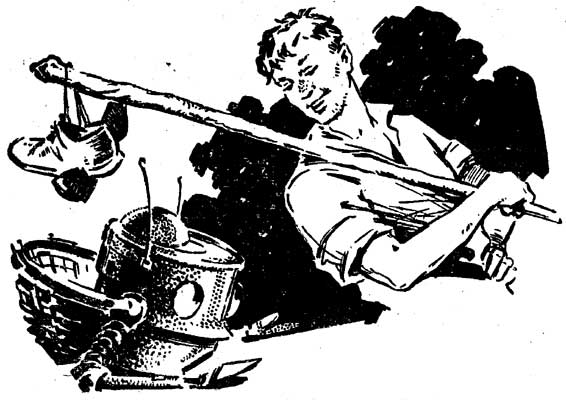
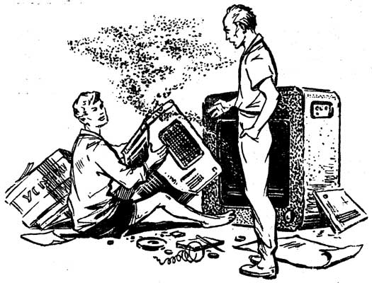

В одной из новелл «Полудня, XXII века» Стругацких («Десантники») только-только вернувшемуся разведчику, изрядно проголодавшемуся в одночасовой миссии, быстро накрывают на стол: «Он извинился перед Сидоровым, снял со стола журналы и накрыл стол хлорвиниловой скатертью. Затем он поставил на стол хлеб, масло, молоко и гречневую кашу». Действие, между тем, происходит на межзвездном корабле, обращающемся вокруг экзопланеты, а едок, с трудом доползающий до стола, секундой ранее снимал защитный костюм, изнемогая от усталости — и вот он уже готов приступить к легко узнаваемому, едва ли не детскому обеду. Подкрепляется он не столько гречкой и молоком, сколько «знакомым», «уютным» как таковым (без всякой приправы unheimliche), домашней едой в ее образцовом приготовлении. Эта сцена и множество подобных в текстах Стругацких указывают на особую аранжировку самой фрагментарности, которая говорит о том, что, в отличие, например, от К.С. Робинсона, Стругацких не волновали логистические реконструкции, или, говоря точнее, подробность описания, расширяющегося в глобальную логистику и мимикрирующего под описания реалистические и в то же время постмодернистские. Подробность и ее исчерпывающий характер не представлялись залогом эффекта реальности. Последний сам подвергся определенной пере- и проработке, позволяющей обходиться с ним намного вольнее, чем требовала каноническая фантастика, выступавшая ответвлением реализма как метажанра.

Например, неточности, встречавшиеся в описании технологических деталей у Жюля Верна, хорошо заметные специалистам и даже комментировавшийся иногда в примечаниях (в частности, в советских изданиях), сами являются точкой равновесия, то есть эта та мера реальности и уточнения, которая позволяет убедить читателя вместе с автором в том, что описываемые события и процессы действительно реализуемы. Попытка выжить на необитаемом острове по рецепту Жюля Верна (например, выплавить сталь или приготовить лекарство), скорее всего, привела бы к краху, но точного следования в данном случае и не требовалось: неточность является той мерой позитивно прорабатываемого технологического мира, которая всегда обещает собственное уточнение, то есть реальность классической фантастики построена, прежде всего, не на репрезентации «будущего» или «иного», которая легко скатывается к собственной проекции на уже данное, а на хорошо взвешенной мере неточности. Колонизаторская фантастика описывает рецептуру bootstrapping’а, но описывает ее принципиально неполно, неточно и с искажениями, однако это не значит, что она просто оставляет место для локального действия и инициативы или же предполагает наличие более полного (стороннего, научного, экспертного) ресурса, который восполнил бы ущербное описание, дописал программу. В отличие от Декарта, Жюль Верн не говорит: «и т.д.», то есть не обрывает «правила для руководства ума» на определенном пункте, после которого «все понятно», скорее, он дает результат в целом, представляя саму процедуру в качестве неточного «краткого пути», сокращения, итога в модусе «вообще говоря» (не отличающегося от самой реальности, поскольку до определенного момента реальность Таинственного или Необитаемого острова остается недособранной). Т.о. реальность — это продуктивное сокращение, которое позволяет пренебрегать отдельными частностями и пробелами в знании. Ее классическая экономия допускает ошибки, предполагая, что даже они не способны нарушить общую траекторию движения: железо все равно будет получено, даже если производится оно по неверной технологии. Разумеется, речь идет не только о железе, но и о самом повествовании, которое производится путем производства железа в технологически некорректном цикле выплавки.

Гиперреалистическое описание (пример — К.С. Робинсон) не может себе такого позволить, просто потому, что оно в конечном счете уже не может опереться на фикцию реальности как сокращения. Гиперкапиталистическое письмо Робинсона является еще и гиперсоциалистическим: это запись самого капитализма после его краха, вернее, после устранения значимых различий между капитализмом и социализмом, — то есть, вопреки Стругацким, будущее означает не реализовавшийся на бытовом уровне коммунизм, а бесконечный крах логистически несовершенного капитализма, расширение компании Amazon до границ вселенной, что влечет полную экспликацию капитализма, предельное выведение в описание и репрезентацию (отсюда гиперубедительность повествования, которая очень скоро перестает убеждать). Возможно, что Робинсон понимает марксизм, прежде всего, как указание на ошибку в описании: прибавочная стоимость, скрывающая эксплуатацию, понимается в таком случае как все то же сокращение реальности, вынесение за скобки определенных элементов, которые не нуждаются в учете просто потому, что результат достигается поверх них и без них, путем спрямления. Гиперкапитализм Робинсона выясняет, что такое спрямление и короткие пути ему более не по карману, а потому реальность становится крайне затратной — в том числе в пересчете на количество слов. Робинсон вполне мог бы быть ООО- или АСТ-писателем: в его тексте обнаруживается огромное количество описаний технологических процессов, объектов, инициатив и т.п., которые иногда деградируют к уровню технической документации, существенное отличие лишь в том, что его, похоже, больше интересует другой вопрос — кто за все это будет платить? Пусть мир состоит из объектов и гиперобъектов, но сколько это стоит?

Можно предположить, что реалистический и, как его производное, научно-фантастический нарратив всегда строился, в том числе на уровне собственно сторителлинга, на тех или иных фигурах кредита, растраты, сокровища, «общей экономии» и т.п., то есть более или менее успешного пренебрежения вопросом о реальной экономике в данный и конкретный момент. Разумеется, фантастика не может полностью примириться с протокольным, актуалистским письмом Робинсона, который он упорно развивает (что во многом и является его новаторским ходом в собственно «фантастике»). Однако это неприятие является следствием не столько «законов» (или, что то же самое, условностей жанра), сколько базовой посылки о конституции реальности путем позитивного пренебрежения к деталям, которое как раз и дает эффект полноты (сокровища или неограниченного ресурса): не важно, кто будет платить, кто-нибудь найдется (или нет). Описание всей реальности у Робинсона оказывается в этом смысле гиперреализмом финансовых и материальных трансферов: в отличие от катастрофических вариантов деконструкции реализма (например, как у Балларда), Робинсон полагает, что реальность ждет не взрыв, производный от очередного капиталистического кризиса, а бесконечная (или дурная) реальность дорогостоящего переописания и рефинансирования. Соответственно, реальность будущего на самом деле редуцируется до уровня руководства по применению, однако такое руководство написано на чрезмерно подробном языке бесконечного уточнения любого трансфера материальных и нематериальных ценностей и ресурсов. В конечном счете, реальность у Робинсона, то есть метафизическая позиция определения реального, как она задается в качестве точки схождения повествования, конструируется в качестве отмены самого представления о возможности «данности» чего бы то ни было в ООО-мире: на то это и мир объектов, что в нем за все должно быть заплачено. Разумеется, реальность платит сама за себя, но только по частям и по этапам, без предоплаты и без кредита, но это ни в коей мере не делает ее «тотальностью», не позволяет погасить долги и найти бесконечный ресурс (аналогичный «счастью» в «Пикнике» Стругацких). Таким образом, Робинсон — это крайне пессимистическая версия Латура, в которой мир полностью совпадает с его объектно-агентным описанием, однако за каждое микроописание приходится платить, то есть оно всегда снабжено своим счетом-фактурой (каковые счета в своей гигантской массе как раз и составляют нарратив), где все подробнейше расписано: кто, что, за чей счет.

Кажется, что оппозиция классической фантастики и катастрофизма/реализма не оставляет места для третьей позиции: в одном случае реальность успевала пробежать по сломанному мосту, прыгнуть выше собственной головы, забирая все выше и выше, в другом, она расписывалась во всех подробностях только для того, чтобы постоянно платить за себя такими описаниями (мы буквально вынуждено платить Робинсону вниманием к бесконечным описаниям), обещая экспансию, но настолько гиперреалистическую, что мало кто готов ей увлечься или поверить в нее. Позиция Стругацких, демонстрируемая указанным примером с «гречкой», оказывается в этом отношении действительно «третьей» позицией, но выполнимость ее доказуема только при условии отказа от определенных принципов первых двух и, в конечном счете, отказа от принципов самой экономии реальности (что может связываться с переходом от научно-фантастического жанра к «просто фантастическому», о котором говорили сами Стругацкие). Действительно, «Полдень» не может быть построен как экспансия провалившегося капитализма, но в то же время не может быть дан и как набросок оптимистического, спрямлявшего ходы, колониального капитализма XIX-XX веков (или империализма). В одной из своих классических статей, посвященных SF, Ф. Джеймисон указывал на то, что задача фантастики — не столько изобразить будущее, сколько изобразить неспособность вообразить это будущее, поскольку такое воображение неизбежно возвращается к настоящему, остраняя его в классическом кантианском и одновременно модернистском жесте. Кажется, что Стругацкие в 60-е годы настолько хорошо освоились с этой базовой проблемой фантастики (демонстрируемой Джеймисоном на примере «Резца небесного» Ле Гуин), что просто нашли ей другое применение. «Реалистические» проблемы Робинсона представимы как структурные проблемы построения сюжета как такового, ставшие локальным сюжетом «Резца небесного»: представляя одну реальность, приходится платить другой реальностью (у Ле Гуин — ее буквальной отменой), что, конечно, означает, прямо противоположное: стоимостью представленной реальности является именно то, что она не позволяет отменить наличную, поскольку последняя является единственным поручительством и единственной ценностью, которой можно расплатиться за другую. Робинсон делает вывод: именно потому, что одной реальностью приходится платить за другую, отменить невозможно ни первую, ни вторую — именно та реальность, которой оплачивается другая, оказывается более фундаментальной и «нередуцируемой», чем mock reality, произведенная на Марсе или в гиперреалистическом сне. На уровне письма та же самая проблема означает, что за конструирование одного мира или его эпизода требует платить по меньшей мере когеренцией, что, в свою очередь, означает запуск логистического процесса письма, который у Робинсона приобретает экспансивный и в то же время катастрофический характер.

Ответ Стругацких на эту ловушку «платной реальности» — двойное «нет»: нет — научной фантастике и нет — экстранаучной фантастике (если в терминах Мейясу), которая бы могла сделать ставку на саму не-когеренцию, обнаруживая в ней парадоксальный ресурс для репрезентации будущего и, соответственно, коммунизма. Действительно, «невозможность» представить будущее или невозможность коммунизма обычно формулируется как неизбежный «захват» любой такой репрезентации нарративным ресурсом настоящего, который сам становится ресурсом лишь в такого рода захвате, который тут же отменяет (или проваливает) поставленную перед ним задачу. Соответственно, репрезентация будущего становится тривиально невозможной, а экономический цикл по обмену одной реальности на другую просто не запускается, все остается на своих местах, в стазисе нерепрезентируемости. Фантастика, вопреки своим намерениям, открывает, что невозможно продать мир, по крайней мере ей крайне трудно найти продавца, как, впрочем, и покупателя. Контр-решение Стругацких состоит не в том, чтобы разогнать эту машину перепродажи и спекуляции, а в том, чтобы, напротив, принять ее провал за отправную точку: элементы настоящего, выделенные в гарантированном провале воображения, в его «торможении», сами должны стать нарративными неподвижными «двигателями» и одновременно точками пристежки повествования, которые позволяют совершать путешествие в будущее, не платя за это путешествие ни копейки (симптоматично название эпизода «Скатерть-самобранка»). С точки зрения стандартной марксистской нарративной критики, «гречка в космосе» (если, конечно, это не космонавт Гречко) является не чем иным, как зримым доказательством провала репрезентации, неизбежно возвращающейся к «столу с клеенкой». Однако Стругацкие, похоже, использовали такой провал как прием, сделав его базовым: проблема не в том, что опереться на подобные элементы «прошлого» сложно, поскольку они должны работать в репрезентации будущего, а в том, как сделать из них своего рода «средства связи» коммунизма и «с коммунизмом». Последнее возможно, если предположить, что такие элементы (еда, имена, состоящие из имени и отчества, привычки и т.п.) составляют «жесткие десигнаторы» и прошлого, и будущего, позволяя нам как читателям и, что главное, самим его обитателям-персонажам легко в нем ориентироваться, но это же означает, что коммунизм оказывается проблемой не столько экономической, сколько навигационной, картографической и, главное, эргономической. «Провешивание» коммунизма, аналогичное процедурам Сталкера, возможно только за счет сохранения огромного массива или архива самих вешек, которые объявляются бесспорным фондом коммунистического общества, которое, соответственно, уже в значительной мере реализовалось. То, что представлялось для фантастики проблемой — невозможность отделаться от такого «заземления» на настоящем, — тут объявляется решением, которое просто нужно уметь использовать. Соответственно, все эти элементы неснятого настоящего в коммунистическом будущем оказываются не «архаизмами» или «пережитками», а именно средой коммунизма, позволяющей его опознавать и ориентироваться в нем. Вопрос о том, кто платит за нее, не встает просто потому, что она досталась в наследство, которое само поддерживается будущим изобилием (по большей части формальным). Т.о. структурно коммунизм Стругацких оказывается специфическим ретрокоммунизмом или коммунизмом наследников и удобств, который решает классические проблемы саморепрезентации за счет того, что видит в проблеме решение, покрываемое доставшимся по наследству (буквально из социалистического быта) фондом.

Соответственно, хотя «остатки гречки» в космосе могут, на первый взгляд, показаться следствием провала репрезентации (или неизбежной слабостью воображения, не способного проработать все экономические и причинно-следственные цепочки в мире «реальной» научной фантастики), в своем позитивном варианте «гречка» выполняет функцию фрагментации, полностью закрывает вопрос сборки фантастической реальности (или коммунизма), как он мог бы пониматься в реалистической фантастике. Возвращение, редукция репрезентации к подобного рода узнаваемым фрагментам сама говорит о том, что реальность коммунизма удобно сегментирована, поделена на комфортные отсеки, более того, она принципиально некосмична или анти-космична. Русский космизм является одной из попыток решить всю ту же экономическую проблему репрезентации коммунистической реальности — либо за счет кредитного взлета, либо за счет тотализации всех трансферов энергии и средств (или, что то же самое, продуктивного овладения всеми возможными силами природы). Экономическая ставка космизма предполагает, что вопрос репрезентации можно решать только целиком, поскольку, говоря логически, если коммунизм не представим как целое, это не коммунизм. Как следствие, внимание критиков утопий традиционно обращается на более или менее вытесненные локусы негативного (смерть, преступность, сумасшествие), которые остаются в самом космичном космосе, хотя бы для того, чтобы служить предлогом для сюжетных поворотов — примером чему может выступать космический проект И.Ефремова. Как ни строй космический коммунизм, в нем все равно будут фатальные пробелы и недостачи, запускающие его логический распад. Однако Стругацкие увидели в космизме путь в никуда, то есть коммунизм надо развести с космизмом. Решением является не тотальное конструирование реальности, неизбежно оставляющее темные пятна негативности, а фрагментация и сегментация, которая делает из осколков неудавшейся репрезентации аттракторы коммунистической реальности.

Десантник возвращается на космический корабль, чтобы поесть гречки. Рацион людей будущего вообще достаточно ограничен, более того, он в изрядной мере совпадает с советским кулинарным каноном («Боги пьют нектар. И едят сациви. Давно я не пробовал сациви»; «Самодвижущиеся дороги»). Такое же совпадение обнаруживается на уровне досуга («На лужайку бы. В травку бы. Полежать. И чтобы речка»; «Десантники»), культурного потребления (заказ книжек из каталога на несколько десятков наименований), аффективных отношений (уехать за возлюбленной на Дальний Восток). Разумеется, планета, как и ее политико-управленческая структура, полностью перестроена («благоустроена»), однако она выступает не столько центром повествования, сколько фоном, обеспечивающим «изобилие», являющееся не чем иным, как способом не проблематизировать способы доставки гречки и борща в космос. Мир будущего распадается на микросреды, микроуровни узнаваемого — довольно скромного, но теперь уже гарантированного — комфорта (его можно было бы назвать мещанским, если бы он уже не был советским). Соответственно, глобальная экономическая проблема развития «производительных сил» может пониматься как проблема такого развития, уровень которого обеспечил бы абсолютно гладкое существование подобных фрагментов, жестких десигнаторов коммунизма, которыми, соответственно, не нужно платить за то, чтобы слетать в космос. Изобилие составляет глобальную экономическую схему лишь гипотетически, декларативно, сюжетно оно является другим именованием сохранения тех остаточных реалий, которым вроде бы место в прошлом, т.о. вся мощь коммунистического режима работает не на «музеификацию» прошлого (что характерно для капиталистических дистопий Ф. Дика), а на его поддержание в максимально рабочем, потребляемом состоянии: неявно Стругацкие указывают на то, что к 60-м был достигнут конец антропологически-потребительской истории человечества: все основные аффекты, потребности и стремления уже полностью сформированы, они не могут кардинально измениться. Выйти за пределы рациона 60-х коммунистический человек неспособен, вернее, это всегда будет выход в этих пределах, этих референциях (доставка еды на дом, «кафе»). Оболочкой для этой замкнутой антропологии является не менее замкнутая бытовая среда, переносимая в любую точку будущего и в любое место в пространстве в готовом виде, как доставляемая на дом кастрюля с борщом.

Хотя подобные «десигнаторы», состоящие из множества бытовых и антропологических деталей, совпадают в какой-то мере с советским бытом 60-х (в его идеальном варианте), в этих сегментарных пространствах, которые поддерживают жанровую фрагментарность новелл, все же встречаются декларативные негативности, которые дублируют, закрывают, залатывают глобальные провалы, которые могли бы обнаружиться в утопии Стругацких (если бы это была утопия). То есть на месте смерти, преступности, hubris и т.д. должна появиться какая-то другая, как правило комичная, лакуна. Об одной из таких лакун упоминается в новелле «Возвращение»:
> — […] ну что такое диваны на кораблях? Отвратительные жесткие устройства! Да разве только на кораблях? Эти невообразимые скамейки на стадионах и в парках! Складные самопадающие стулья в кафе! А ужасные камни на морских купаниях? […] искусство создания по-настоящему комфортабельных лежбищ безвозвратно утрачено в нашу суровую эпоху эмбриомеханики […].
> — […] я застал еще то время, когда в Северной Америке подвизались всякие там фирмы и монополии. Так вот, дольше всех продержалась небольшая фирма, которая сколотила себе за полтора века баснословный капитал на матрасах. Она выпускала какие-то особенные шелковые матрасы — немного, но страшно дорого. Говорят, миллиардеры дрались из-за этих матрасов. Замечательные были матрасы! На них ничего нельзя было отлежать.

«Катастрофический» пробел в мире коммунизма, а именно отсутствие эргономических матрасов, говорит о том, что в такой фрагментарной сборке бытовых удобств и привычных способов потребления любые жертвы носят довольно условный, едва ли не юмористический характер. Вся сцена — одна из множества мета-шуток, разыгрывающих ожидания читателя, ждущего от мира коммунизма слишком богатых возможностей: здесь все возможно и все совершенно комфортно, однако есть определенные пробелы, которые, впрочем, легко списать со счета как идиосинкразии: в конце концов, мир будущего сделан не для того, чтобы лежать на боку. Подобные вписанные в повествование и в то же время метанарративные розыгрыши выполняют, прежде всего, функцию устранения имплицитного глобального антагонизма, который по законам жанра должен был затаиться где-то на задворках (вернее, в самом центре, в слепом пятне) повествования (например, как сверхдетерминация «разрухи» в «1984» Оруэлла, о которой говорит Джеймисон). Возможно, коммунизм — это и правда мир, в котором неудобно лежать, но дальше этого «противоречия» продвинутся невозможно, поскольку оно само выписано в категориях антропологического удобства.

Однако еще более важная функция этих розыгрышей (примером которых может стать эпизод с заказанным автоматом по производству готовых блюд, который оказывается стиральной машинкой) состоит в организации самого этого микропространства агентов, без которого жесткие десигнаторы так и пустовали бы как незанятые кресла, были лишь пережитками, необъяснимым образом сохранившимися с момента их замораживания в развитом социализме (или чуть раньше, но точно позже империализма). Иными словами, внутри- и метанарративные розыгрыши как раз и организуют все это пространство репрезентации, позволяя перемещаться в отдаленное будущее в вакуоли привычных удобств, поскольку только они прошивают собой как сигналом связи микроколлективы, выступающие реальными носителями коммунистического сознания. Действительно, помимо проблемы репрезентации в ее чистом виде, Стругацкие решают также классическую проблему коммунистического субъекта, совпадающую, в частности, с проблемой Сартра в «Критике диалектического разума». Проблема состоит в том, как конституировать субъекта, который не был бы индивидом и в то же время не относился бы к генерализованным, статистическим реальностям класса, массы и т.п. Следовательно, вопрос в том, чем будет «группа в слиянии» (groupe en fusion) или «группа-субъект», если учесть, что в коммунистической реальности не может быть тех условий (репрессий) перехода от «сериальности» к «слиянию», которые для Сартра выступали исходным примером.

В качестве гипотезы, подтверждаемой нарративным устройством коммунизма, можно предположить, что такой «группой в слиянии» у Стругацких выступает, прежде всего, ограничиваемая жесткими бытовыми десигнаторами (не меняющимися при переходе из социализма в коммунизм и представляющими своего рода статичные «машины времени»), «группа розыгрыша», то есть, как правило, молодежная группа взаимного подтрунивания, конкуренции и состязательности (одноклассники, одногруппники, члены одной команды, одной смены и т.п.). Именно розыгрыш (каламбур, шуточный вызов и т.д.), адресуемый одним членом группы другому и в то же время авторами читателю, создает энергию fusion, которая позволяет заселять эти фрагментарные устройства быта коммунистическими (и космическими — или комическими?) путешественниками. Соответственно, коммунизм «Полудня» нередко приобретает оттенок капустника: авторы вышучивают «космически» завышенные ожидания читателей и используют те же шутки как коммуникативный механизм, сцепляющий группу в локального субъекта, который связан коммунистическим вектором, приравненным к вектору молодежной предприимчивости и пытливости. Все повествование, таким образом, отчасти приобретает оттенок young adult как отдельного жанра: коммунизм —дело молодых не потому, что им многое по плечу, а потому, что они организуют временные сообщества состязательности и розыгрышей, пробуя себя и других. Даже космонавты, возвращающиеся после длительной отлучки и попадающие, де факто, в собственное будущее, став номинально стариками, сохраняют контур такой подростковой группы в слиянии. Коммунизм возможен как производное молодежных группировок, которые не подвязаны под большие механизмы управления (по сути, обеспечивающие их фрагментарное и одновременно бездефицитное, оранжерейное, хотя временами и героическое, существование).

В одном из выступлений Мишель Серр заметил, что, хотя формально Юрий Гагарин первым отправился в космос, истинной новацией этого события была не техника и не собственно присутствие человека за пределами атмосферы, а то, что он «никуда не уезжал», поскольку постоянно оставался на связи. Отличие космических путешествий начала 60-х гг. от классического жанра путешествий первооткрывателей в том, что путешественник сам становится дистанционным сенсором, с которым поддерживается постоянная связь, устойчивый канал, который не должен прерываться ни на минуту, тогда как раньше моряк в какой-то момент «отключал связь», исчезал за горизонтом и мог и вовсе пропасть без вести. Другими словами, реальные космические путешествия — вопреки космизму — начинаются не с тотализации, а с создания своего рода якоря, устойчивой медиа-среды, поддерживающей сигнал в вечной петле обратной связи. Та же самая проблема возникает и в фантастике, то есть в путешествиях в коммунизм — как создать такой канал связи, который будет поддерживать коммуникацию между читателем и персонажем, но при этом не будет подрывать саму задачу, формулируемую как «открытие коммунизма». Стругацкие находят решение на грани фола, то есть буквально на грани падения и впадения в школьный или студенческий юмор, бесконечный КВН, который постепенно продвигается в коммунистическое будущее, нисколько не меняясь, что обеспечивается постоянством каналом связи, созданной бытовыми удобствами как своего рода коммуникационными приборами. Хотя это решение кажется крайне удачным, за него приходится платить тем же, чем и в космических полетах: медиатизация космонавта равнозначна медиатизации коммуниста, который оказывается не более, чем сенсорной оснасткой жестких десигнаторов, живым сенсором, которому любое внешнее представляется либо своего рода деградацией (как на отсталых планетах), либо просто поводом для физической, спортивной удали, в контексте которой приходится решать задачи, самое большее, приоритета результата и безопасности (выживания, новелла «Десантники»). Возможно, базовая оппозиция «Полудня» в такого рода решениях — повременить и переждать или броситься вперед и сломать голову сразу? Ни то, ни другое не предполагает размыкание «канала связи», что, собственно, и является условием воздействия на отсталые миры. Само это воздействие всегда построено на безусловном превосходстве, в котором обыгрываются стандартные для young adult темы инаковости, нарциссического всемогущества и в то же время защищенности, неприступности (ср., например, с «Сумерками» С.Майер). Возможно, прогрессоры — те же вампиры (или наоборот), у них, конечно, есть слабые места, но они никогда не теряют связи, по крайней мере с самими собой, тогда как деградировавшие миры, являются, напротив, теми, что, в терминах Серра, «уехали», безнадежно отбыли, отключившись от устойчивого канала коммуникационного коммунизма.

(*Опубликовано также на сайте [Горький](https://gorky.media/context/grechka-v-kosmose-kak-izobrazhali-kommunizm-bratya-strugatskie/)*)

*В оформлении статьи использованы иллюстрации [Макарова Ю.Г.](http://www.rusf.ru/abs/s_ma.htm#sa) к изданию 1967 г.*