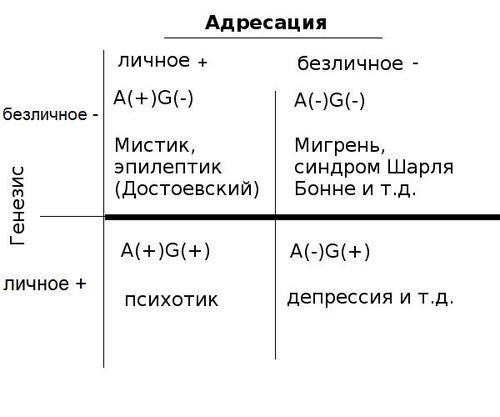

Что такое галлюцинация? Это небытие, данное в ощущениях. Наличие такого небытия всегда несколько раздражало философов – например, Декарта, который понимал, что можно принимать себя за короля или за стекло, и нет никаких способов разувериться в этом. Незначительный эпизод в методическом сомнении, в котором допускается галлюцинаторный опыт, стал, как известно, одним из текстуальных поводов для распри Фуко и Деррида («Когито и история безумия»). Первый обнаружил у Декарта фундаментальный для Нового времени жест вытеснения, маркирования и изоляции безумцев, то есть тех, кто не определился со своим небытием должным образом. Тезис о большом интернировании сам по себе спорен, однако на бытовом уровне вполне очевиден: принимая свое небытие за самого себя, нельзя, в конечном счете, не подвергнуться изоляции. Общество в таком случае – не столько система правил и законов, сколько способ управления коллективным и индивидуальным небытием: например, сны и мечты допустимы (и доступны) для каждого, а вот галлюцинации – совсем другое дело.

Оливер Сакс в своей новой книге [«Галлюцинации»](https://knopfdoubleday.com/2012/11/20/hallucinations-by-oliver-sacks/) смещает именно нормативную оценку, обозначает то место, в котором галлюцинации не требуют жестких ответных мер и вообще оказываются даже не распространенным явлением, а целым миром, интернировать который невозможно. Как и в других своих работах, Сакс совмещает стили современного ученого-невролога и гуманитария-энциклопедиста, для которого книги сто- или двухсотлетней давности часто важнее современных научных статей. Так, одной из отправных историй выступают исследования Шарля Бонне, по имени которого назван «синдром Шарля Бонне» – едва ли не самое распространенное галлюцинаторное расстройство у пожилых людей с нарушениями зрения. Бонне, один из пионеров физиологии органов чувств и автор «Аналитического эссе о способностях души», узнал от своего деда Шарля Люллена о странных видениях, которые тот постоянно испытывал. Начались они с чего-то подобного «носовому платку» и «небольшому желтому кругу», но вскоре Люллен стал видеть и людей, которых не всегда отличал от тех, кто реально находился рядом с ним. В других случаях ему привиделись: «рой пятен, внезапно превратившихся в стайку голубей», «карета, остановившаяся у противоположного дома и внезапно выросшая до уровня кровли» (что стало с Золушкой — неизвестно), «колесо в воздухе» и т.д., и т.п. У большинства синдром Бонне ограничивается визуальными эффектами, геометрическими формами и т. п., но не редки и случаи гораздо более полных «сценических» галлюцинаций с множеством людей, пейзажей и т. п. Во всех случаях такие галлюцинации носят компенсаторный характер, будучи связанными с нарушением зрительной функции на органическом уровне. При этом компенсация часто переигрывает реальность – галлюцинации ярче, сложнее и богаче того, что можно увидеть в жизни. Физиологически галлюцинации – это зрение (поскольку участвуют те же отделы мозга, в отличие от сна или воображения), но зрение усиленное, освобожденное от собственной функции «видеть нечто». Безобъектное зрение.

Сакс описывает такое многообразие галлюцинаций – зрительных, слуховых, обонятельных, связанных с мигренью, эпилепсией, паркинсонизмом, и т. д., что возникает впечатление, что ничего, кроме этого яркого и насыщенного небытия, в общем-то, и нет. По крайней мере, на опасения Декарта можно ответить только викторианским воздержанием и любопытством. Но здесь сразу выясняется момент, который отделяет «органические галлюцинации» от «психотических»: первые всегда более или менее нейтральны по отношению к тому, кто их испытывает, в отличие от шизофренических галлюцинаций. Их содержание «есть», но оно не важно. По сути, Сакс вообще не рассматривает «психотические» галлюцинации, за исключением некоторых пограничных случаев, вроде бреда (в том числе при белой горячке) и галлюцинаций, связанных с утратой близкого человека (в этих случаях они также выступают компенсацией). Иными словами, вопрос о большом интернировании «безумцев» решается лишь частично – за счет того, что часть видящих галлюцинации признается нормальными людьми, которым не нужно давать специальные препараты (они могут помогать, а могут и нет). Но одновременно формируется одна из ключевых характеристик новой нормальности: то, что вы видите, может быть небытием, но оно не должно обращаться к вам, не должно вас интерпеллировать. Например, существенное отличие «нейтральных» слуховых галлюцинаций заключается в том, что это голоса (или музыка, звуки и т.п.), которые «просто слышно», но которые не говорят с Вами лично. В отличие от психоза, когда голос обращен непосредственно к слышащему его, причем он может приказывать, ругать, насмехаться и так далее. Граница проходит именно по адресации: можно видеть ничто, но не позволяйте ему обращаться к Вам, иначе сойдете с ума. «Безумцы», оставшиеся за рамками описаний Сакса, – это те, на кого ничто само обращает внимание. Тогда как пациенты Сакса – в большинстве своем умные и интеллигентные люди, которые видят галлюцинации, но не приходят от этого в ажиотаж. Сложные галлюцинации создают подчас жизненный мир, неотличимый для самого галлюцинирующего от сегментов его реальной жизни – но он все равно может знать, что «это – галлюцинация». По сути, норма маркируется лишь возможностью такого пустого знания, которая сопровождается «не-вписанностью» в контекст: именно этот момент отличает героев Сакса от психотиков – они никак не задействованы на «личном» уровне в свои галлюцинации, никак не вкладываются в них, а рассматривают их в качестве некоей эмпирической подробности, которая может раздражать или, наоборот, развлекать (например, пациент с постоянными музыкальными галлюцинациями может наслаждаться ими, что уже не так далеко до эпилептиков, которые пытаются специально провоцировать приступы). 

Невовлеченность, нежелание интерпеллироваться и отсутствие любой коммуникации между галлюцинирующим и галлюцинаций – это базовый маркер границы, за которой начинается психоз. Интересно, что для психотика, по сути, «Я» как такового уже нет, но именно потому, что он слишком многое принял на свой счет, ответив на зов небытия, тогда как для человека с синдромом Шарля Бонне вопрос о «Я» просто не ставится: Я – это не более, чем нейтралитет по отношению к бытийным вопросам, которые иногда ставятся в достаточно назойливой форме. Для него галлюцинации произвели «границу диегезиса», открывающую, что и вообще весь чувственный опыт находится за этой границей, в пространстве повествования, с которым сам наблюдатель никак не ассоциируется.

Но это, так сказать, лишь феноменологический уровень нормального галлюцинирующего. В главах, посвященных мигрени («Паттерны: визуальные мигрени»), а также эпилепсии и измененным состояниям сознания, Сакс описывает галлюцинации как «окна в работу нервной системы». Наиболее сильная в этом отношении глава о мигренях, которыми Сакс сам страдает с детства. В возрасте около 4 лет он впервые столкнулся с «аурой» мигрени – видением световой арки с блистающими зигзагообразыми краями, которая росла в поле зрения, переливаясь голубым и оранжевым цветом. За аурой следует временная слепота и собственно приступ боли (хотя не всегда). Мать Сакса, также страдавшая от мигрени, быстро объяснила сыну, что особенно бояться нечего. Впоследствии он обследовал множество больных мигренью и написал о ней отдельную книгу, которая так и называлась – «Мигрень». Специфическое слепое пятно (scotoma), появляющееся в поле зрения при приступе мигрени, нередко оказывается зоной галлюцинаторно складывающихся паттернов – пересекающихся линий и геометрических структур. Многие напоминают движущиеся «турецкие ковры», «сложные мозаики» или «трехмерные структуры вроде шишек или морских ежей». При этом могут наблюдаться многие другие расстройства восприятия, например изменения образа тела (ощущение уменьшения или увеличения размера тела, удлинения конечностей и т. п.), обонятельные галлюцинации и даже подлинные галлюцинации: так один из больных, страдавший мигренью, при приступе регулярно видел человека, вылезающего из люка, причем на голове у него была белая шляпа с рисунком американского флага. Также могут быть лексические галлюцинации, видения «лилипутов» и т. д. – мигрень в этом смысле практически неисчерпаема. Но все эти галлюцинации не только «нейтральны», но еще и универсальны, являясь, как утверждает неврология, не более, чем отображением самоорганизации нервных клеток под действием проходящего по ним импульса, распространяющегося из того или иного сверхактивного центра мозга (который, кстати говоря, и подвергается воздействию при оперативном лечении эпилепсии). Сакс пишет: «Мигрене-образные паттерны можно найти в исламском искусстве, в классическом или средневековом орнаменте, в сапотекской архитектуре, в рисунках на коре, создаваемых австралийскими аборигенами, в керамике навахо из Акома-Пуэбло, в корзинах свази». С другой стороны, эти паттерны крайне близки, как показал Хайнрих Клювер, к геометрическим галлюцинациям, вызванным мескалином».

Почему же наша культура построена по модели «мигрени»? Неврология полагает, что в основе всех этих паттернов – общая модель возбуждения, в первую очередь, рецепторов ориентации в первичной зрительной коре. Динамические аспекты «мигрене-подобных» галлюцинаций объясняются тем, как именно самоорганизуются миллионы нервных клеток на «базовом уровне, ниже любого личного опыта». «Галлюцинаторные формы – это, в определенном смысле, физиологические универсалии человеческого опыта». И такая самоорганизация не ограничены живыми существами: «ее можно увидеть в формировании кристаллов снега, в водоворотах и вихрях потоков воды, в некоторых осциллирующих химических реакциях. В этих случаях самоорганизация также может породить геометрические фигуры и паттерны в пространстве и времени, крайне напоминающие те, что мы видим в ауре мигрени. В этом смысле, геометрические галлюцинации мигрени позволяют нам на себе испытать не только универсальные принципы работы нейронов, но и универсалии самой природы». Бинго!

Выписываемые Саксом контуры нормальности становятся все страннее и страннее (вместе с вполне типичными галлюцинациями Кэролла и Алисы, то увеличивающейся, то уменьшающейся). При мигрени и эпилепсии, как образцовых «нормальных» патологиях, порождающих галлюцинации, видящий их, на самом деле, смотрит даже не в свой мозг, а еще глубже – в органическую и неорганическую природу. Видимое им практически ничем не отличается от объективных снимков томографа (или любого иного экрана, на котором отображается «картина» работы мозга, опирающейся на неорганические закономерности). Тема самоорганизации, популярная уже не первое десятилетие, время от времени выходит на передний план, представляясь чуть ли универсальным инструментом (что, например, привело к превращению синергетики в своеобразную фрик-философию, применявшуюся ко всему подряд). Такие авторы, как Мануэль Деланда, использовали вслед за Делезом понятие «машинного филума», обозначающее логику самоорганизации и последовательного формирования паттернов, охватывающих как органические, так и неорганические сущности. Сегодня этот «машинный филум» разглядели неврологи, которые понимают его вполне буквально: галлюцинации – это pattern recognition, но в том смысле, что паттерн распознает сам себя (то есть складывается) и лишь потом отображается в форме того, чего нет, небытия, видимого на экране сознания. Галлюцинации – предельно нечеловеческое, с чем можно встретиться, не подвергаясь особому риску.

Таким образом, чтобы видеть галлюцинации и оставаться нормальным, то есть не попасть в сумасшедший дом, нужно смотреть – через окно работы нейронов – на сам машинный филум. Но не стоит принимать его слишком уж всерьез. Общий лейтмотив Сакса – «спокойствие, только спокойствие!». Не надо ничего мистифицировать, даже эпилептические «прозрения» (в стиле Достоевского). Норма – это когда видишь машинный филум, бесконечные и не имеющие никакого к тебе отношения паттерны, но не впадаешь в  психологическую аффектацию. Сама по себе галлюцинация может оставаться нейтральной, но при этом производить аффект, связанный с тем, как к ней относишься. Например, многие пациенты с тем же синдромом Шарля Бонне могут пугаться самого факта галлюцинации, но делать этого не стоит. По сути, Сакс просто учит спокойно жить со своими галлюцинациями – «да, они открывают нечеловеческое бытие, универсалии, ну и что с того, нечеловеческого вы что ли не видели?». К вам-то это не имеет никакого отношения. Имплицитная онтология Сакса чем-то напоминает онтологию Бадью: бытие само по себе не имеет значения или смысла, представляясь, скорее, нечеловеческим машинным филумом (или математическим – Сакс связывает самоорганизацию и паттерны с числами Фибоначчи), но, в отличие от Бадью, сам этот базовый уровень может быть дан на чувственном уровне в качестве небытия, галлюцинации (а не только рационально, в теории). И эта данность является одним из модусов этого бытия, значительно усложняющим схемы субъективации – того, как откликается или не откликается галлюцинирующий на галлюцинации разного уровня и типа.

В самом деле, если дополнить Сакса, можно выписать общую матрицу нормальности, которая одновременно оказывается матрицей производства небытия, данного в чувствах. С одной стороны, у нас есть, условно говоря, «ось адресации» (или ангажемента и интерпелляции – далее ось A). Она принимает два значения – плюс и минус. То есть возможны галлюцинации, которые ангажируют и интерпеллирует галлюцинирующего, призывают его и даже, в пределе, изменяют саму его личность (он становится вице-президентом Индии, стеклом, Наполеоном и т.д.). Обозначим это качество как А(+). И наоборот – есть те галлюцинации, которые никак не обращены к галлюцинирующему, которые не претендуют на то, что являются его истиной, не ангажируют его – А(-). Галлюцинирующий равнодушно или с легким интересом наблюдает за ними, и только.

Вторую ось можно условно назвать осью реализации или генезиса (далее G) – тут вопрос в том, на каком именно уровне производятся галлюцинации. Особенность мигрени или эпилепсии в том, что они, хотя и порождают определенные психологические эффекты, сами лишены психологической истории. Это чистая самоорганизации, которая осуществляется ниже уровня «нейронов» и даже ниже «жизни» как таковой, не говоря уже о личности. На этой оси можно отложить несколько значений, которые условно мы также разобьем на «+» и «-». С одной стороны, есть предельно безличный генезис, отсылающий к неорганическим, нечеловеческим механизмам, чистым веществам, вступающим в самоорганизующиеся реакции (в рассказах Сакса не раз можно заметить его детскую  страсть – химию). Пусть это будет G(-) (безличный, анонимный genesis). С другой стороны, есть галлюцинации, оставшиеся за пределами рассмотрения Сакса, которые имеют именно психологическую, личную, экзистенциальную и т. п. этиологию, хотя и реализуются, в конечном счете, тоже на нейронном уровне (но при этом могут совершенно не иметь «паттерно-подобного» вида, ограничиваясь расстройствами самой личности). Назовем это значение G(+). Т.о., ось генезиса представляет собой нейрологическую версию универсальности: чем ближе мы на ней к отрицательному значению, тем более универсальное бытие нам дано в чувственном небытии (галлюцинации). И наоборот, чем ближе мы к положительному значению, тем больше галлюцинация – просто «наше личное», частное дело, тем больше мы ограничены некоей психологической историей и зациклены на ней. 

Выписываемая благодаря двум этим осям матрица дает, соответственно, четыре значения, демонстрирующие, что адресация и экзистенциальный ангажемент – по крайней мере теоретически – не обязательно коррелируют с генезисом (иными словами, галлюцинирующий способен обманываться в том, что относится к нему, а что – нет). Образцом для Сакса выступает не-ангажирующая (по оси адресации) и фундаментально-универсальная галлюцинация безличного толка – то есть А(-)G(-). Это, прежде всего, больной мигренью, но также синдромом Шарля Бонне, больной паркинсонизмом и т. д. Вторая явно обозначенная позиция, не интересная Саксу, поскольку она является традиционным предметом психиатрии и психоанализа, – это галлюцинирующей, к которому галлюцинации обращаются (ангажируют его) и при этом сами производятся лишь в рамках личной истории, неуниверсально, – то есть А(+) G(+). Эти позиции, как легко заметить, симметричны, то есть мы получаем их путем простого обращения знака по обеим осям.

Однако мы еще не заполнили две других клетки. Чтобы попасть в клетку с «личной адресацией» (А(+)), но с «безличным», универсальным генезисом (G(-)), полезно рассмотреть случай эпилептика. С одной стороны, он относится к клетке А(-)G(-), представляясь фаворитом этой матрицы. С другой, для эпилептика нередки случаи субъективации того «машинного» опыта, который открывается ему в галлюцинациях. Примером выступает Достоевский, много раз описывавший опыт эпилептического просветления, который ни с чем невозможно спутать. Т.о. эпилептик в какой-то момент принимает безличную самоорганизацию «на свой счет», присваивает ее в качестве некоего божественного откровения, которое открывается именно ему, то есть не «слушает» галлюцинацию, которая обращалась бы к нему, а непосредственно интерпретирует ее, сам ее факт, в качестве обращения и послания. Это послание, разумеется, раскрывает «универсальное», поскольку по оси генезиса мы имеем здесь G(-), однако эпистемологическая ошибка эпилептика в том, что он не может понять галлюцинацию в качестве чего-то бессмысленного, поскольку никак к нему не относящегося – она становится самодостаточной адресацией, даже если не обращена к нему напрямую. Безличный механизм бытия он переводит в режим настоящего «зова бытия», обращенного к нему и выделяющего его (без эпилепсии он был бы вполне заурядным), становится пророком того, чему пророки не нужны. Такая игра между безличным производством и его присвоением в качестве единственного механизма субъективации (вплоть до намеренного провоцирования эпилептических припадков) сдвигает эпилептика в сторону «мистика», который оказывается главным обитателем клетки А(+)G(-). Мистик систематически принимает безличный механизм за то, что касается лично его и предполагает, что как раз до воздействия небытия в его ощущениях он сам был ничем. То, что на деле является демонстрацией полной безадресности (самопроизвольной сборки нейронов), он считает письмом, написанным конкретно для него и подписанным рукой реального.

Не совсем ясен вопрос, можно ли перейти от обычного психотика, который, что интересно, оказался сосредоточением личного (А(+)G(+)), своеобразным implosion личного, к А(+)G(-), то есть может ли он сдвинуться от психоза к «безличному» механизму производства галлюцинаций, отвергнуть свою собственную историю, но так, чтобы раскрылась аперсональная самоорганизация. В определенном смысле, именно так, видимо, можно понимать предложенное некогда Делезом и Гваттари движение «раскодирования», описываемое шизоанализом, – как переход от А(+)G(+) к А(+)G(-). Сумасшедший может стать мистиком, но только в том случае, если перестанет откликаться на галлюцинации, считать, будто они говорят с ним и о нем, и начнет понимать в качестве адресации сам их абстрактный факт. Интересно, что в логике Сакса позиция А(-)G(-) является все же более радикальной, хотя и – внешне – менее героической, чем А(+)G(-). В каком-то смысле, аура мигрени все-таки ближе к машинному филуму, чем глобальный бред раскодированного шизофреника. При этом переход от А(+)G(+) (психотика) к А(-)G(-), вероятно, невозможен: никакая личная история не способна породить мигрене-подобные состояния и абстрактные галлюцинации, если их уже нет. Для психотика это «слишком просто», но на самом деле это не так.

Получается, что позиция A(-)G(-) оказывается радикальным – хотя и негромким – подрывом традиционной логики «трангрессии» к бытию, которая, когда речь заходила об общении с «первым по природе», неизбежно требовала того или иного преображения общающегося, жертв, тяжелой работы и т. д. Позиция Сакса – это онтологическое «единоголосие», обернувшееся викторианским спокойствием: можно прикоснуться к тайнам бытия, но не думайте, что это настолько интересно и что это будет иметь для Вас какое-то радикальное значение или какие-то последствия. Именно отсутствие такого значения – вот что интересно в галлюцинации. Не нужно предпринимать какие-то специальные усилия – галлюцинация или есть, или нет (правда, тут остается вопрос галлюциногенов, который также обсуждается Саксом, но в общем спокойном модусе). Саксовский «нормальный» человек всю жизнь мучается мигренью, на старости лет его одолевает паркинсонизм или синдром Шарля Бонне, но при этом он периодически видит само «реальное», просто не делает из него чего-то особенное, не стремится к нему специально и не заигрывает с ним – сама вежливость с легким оттенком безразличия. «Спокойствие» означает тут не только принцип научного исследования, но и своеобразный этический императив: увидеть реальное можно только через небытие, но не стоит превращать его в культ. Это аутентичность, но без ауры (хотя она и дана в ауре мигрени).

Наконец, у нас осталась последняя клетка – безличной адресации, но личного генезиса, А(-) G(+). Кажется, что она должна оставаться пустой – в самом деле, как то, что порождается лишь на личном уровне (пусть и вовлекая безличные нейромеханизмы), способно «не обращаться» к нам, не ставить нашу жизнь под вопрос, не требовать каких-то изменений, исправлений, покаяний и т.п.? Однако, присмотревшись к этой клетке, несложно понять, что она-то как раз и представляет современные «психические расстройства», которыми занимается большинство практикующих психологов. Собственно, современная психопатология (депрессия, маниакально-депрессивное расстройство, фобии, навязчивые состояния, компульсивно-обсессивные расстройства и т. д.) характеризуются тем, что их личный генезис можно вскрыть, но это уже ничего не значит. Вероятно, депрессию можно охарактеризовать как то личное, что в принципе не может быть ангажирующим и интерпеллирующим. В определенном смысле, это именно такое расстройство, при котором все личное уже не имеет никакого значения, и это само по себе болезненно. А потому оно может пониматься только как некий безличный, произвольный, независимый механизм, создающий нейтральный фон, который нужно просто терпеть – так же, как приступ мигрени или визуальную галлюцинацию при синдроме Шарля Бонне. Сама «личность» со всей ее историей становится неприятным фоном, который не имеет для меня никакого значения, поскольку он в принципе не может быть обращен ко мне. Ясно, что больной депрессией – это, как следует из логики двух осей, противоположность мистика. Если последний принимает безличный механизм за личное обращение, то, второй, напротив, может перенести личное производство собственного состояния только в качестве чего-то безличного, никак не обращенного к нему. Депрессия и прочие современные расстройства всегда содержит поэтому определенный рефлексивный момент – с одной стороны, такая «дезадресация» сама выступает в качестве защитного механизма (справиться с проблемой можно лишь отказавшись понимать то, что она имеет отношение именно к тебе, то есть лишь уйдя от такого якобы естественного понимания), а с другой, дезадресация  составляет саму проблему (именно потому, что личная история не может быть обращена к собственному адресату, последний как раз и страдает депрессией). Если герой Сакса видит галлюцинации и «терпит» их как некий нейтральный фон, то современный человек с той или иной психопатологией воспринимает в качестве некоего достаточно нейтрального, но иногда назойливого фона свою собственную историю, себя как личность, и, соответственно, все то, что эта история может ему сказать. Невозможность ангажироваться в «свои же» проблемы, порождая рефлексивное удвоение этих проблем, создает клетку – А(-)G(+) – в которой галлюцинации вообще невозможны. Поэтому Сакс нигде не упоминает больных депрессией, обсессивно-компульсивным расстройством и т. д. Их лечение возможно, в основном, именно медикаментозными, то есть безличными методами – узнать в личном производстве проблемы «себя» не представляется возможным, происходит полный pattern misrecognition. 

Общее распределение позиций:

Несмотря на эту схему, которая, казалось бы, запрещает переходы из одной клетки в другую, Сакс дает – больше между строк – свой ответ на вопрос «На что же мы можем надеяться?». И можем ли вообще или же принуждены оставаться в рамках нормальных галлюцинаций или нормальных психопатологий, общаясь периодически с аперсональным и нечеловеческим, но не придавая этому общению слишком большого значения? Правда ли что мигрень – предел того, что доступно человеку в онтологическом плане?

Один из вариантов движения между клетками представлен личной историей самого Сакса, некоторые эпизоды которой изложены в главе об измененных состояниях сознания и галлюцинациях, вызванных наркотиками. Сакс начал принимать наркотики в 60-е годы – в основном, как сам он пишет, из научного интереса. В те годы отношение к ним было гораздо более лояльным, в Колумбийском университете проходили масштабные исследования влияния LSD, которую Сакс со своим другом первоначально вполне легально выписывал из Швейцарии. Сакс испытал самые разные наркотические галлюцинации. В 1967 году он  работал в Нью-Йорке в клинике мигреней и время от времени устраивал себе «drug holidays», принимая амфетамины либо собственноручно приготовленные смеси. Работая несколько месяцев над проблемами мигрени, Сакс однажды обнаружил в библиотеке произведение Эдварда Ливина «О мигрени,  головной боли и некоторых связанных с ними расстройствах», написанное в 1873 году. В одни из своих «нарко-выходных» Сакс, пытавшийся прийти к всеобъемлющему пониманию мигрени, прочитал все 500 страниц Ливина за 10 часов, пребывая в состоянии «кататонической концентрации»: «Читая, мне казалось, что я сам стал Ливином и на самом деле вижу описываемых им пациентов. Временами я был не уверен в том, читаю я книгу или пишу ее. Я ощущал себя жителем дикенсоновского Лондона 1860-1870 годов… Его книга напомнила мне принадлежащее Мэйхью великолепное исследование рабочего класса Лондона, но также оно показывало, насколько хорошо Ливин был подкован в биологии и физических науках, являясь при этом подлинным мастером клинического наблюдения. Это самое лучшее, что было в науке и медицине средней викторианской эпохи, настоящий шедевр».

Книга – в полу-галлюцинаторном опыте Сакса – дала ему то, что он не мог получить из множества научных статей. Но настоящее озарение пришло тогда, когда он стал обдумывать, кто же в современной науке мог претендовать на роль Ливина, кто обладал таким же научным талантом. «Множество имен всплывало в моей памяти… все это хорошие люди, но ни в одном из них не было этого сочетания науки и гуманизма, которым был так силен Ливин. И тут очень громкий внутренний голос сказал мне: «Да это же ты сам, придурок! Ты и есть этот человек!». Так Сакс понял, кем он должен стать в современной науке, галлюцинаторным образом отождествившись с Эдвардом Ливином и решив, что он будет таким же – но уже сейчас, а не в 19 веке. Вернувшись в нормальное состояние, Сакс сумел «сохранить чувство просветления и понимания. Я получил некое откровение о мигрени. Я ощущал решимость, указывающую, что могу написать книгу не хуже Ливина, могу быть Ливином нашего времени».

Другими словами, призвание, которое необходимо каждому, возможно лишь на специально выстроенной сцене, где можно передвинуться от безличной адресации к личной, замкнув содержание галлюцинаций на самого себя. Для этого, разумеется, должно было сложиться несколько элементов – тот факт, что Сакс сам болеет мигренью (A(-)G(-)), но при этом изучает ее и благодаря наркотикам на короткое время попадает в зону А(+)G(-), захватывая ее часть, порцию в качестве призвания, но не оставаясь в ней навсегда (в качестве мистика) и не скатываясь в позицию психотика, реально воображающего себя Ливином (A(+)G(+)). С точки зрения привилегированной безличной позиции A(-)G(-), Сакс дважды обманывает сам себя – полагая, что книга девятнадцатого века «лучше» современных научных статей (хотя, скорее всего, их просто нельзя сравнивать), и принимая самого себя за Ливина, то есть переводя безличную по своему механизму (то есть наркотическую) галлюцинацию в план личной адресации. Но именно такой двойной обман позволяет захватить из «личной» зоны адресации субъективирующую порцию галлюцинации, некий химический «радикал» субъективации, не растворившись безвозвратно в адресации. По Саксу, именно растворение в адресации грозит полным обезличиванием (психотик – это черная дыра, implosion Эго, а не его отсутствие), тогда как «нормальная» самореализация зависит от подобных «рейдов» в сторону адресующих галлюцинаций, но не отождествления «с самим собой» в их диапазоне. Надо захватить порцию, глоток личного обращения, но не принимать его все же слишком всерьез и, тем более, не отвечать на него.

Другой пример продуктивного движения внутри галлюцинаций, не приводящего ни к психозу, ни к мистицизму, – поиск «настоящего индиго», загадочного цвета, который, по некоторым версиям, входит в спектр, но не только не встречается в «чистом» виде, но и зачастую вообще не признается в качестве отдельного цвета. Сакс прочитал о видении индиго у Теофиля Готье, описавшего собственный галлюцинаторный опыт, вызванный гашишем. В 1964 году, давно желая «увидеть индиго», Сакс использовал смесь амфетамина, LSD и марихуаны. Приняв ее, он громко заявил: «Хочу видеть индиго – сейчас же!». После чего ему действительно явилось огромное пятно «чистейшего индиго… это был цвет неба, тот самый цвет, который, наверно, Джотто пытался получить всю свою жизнь, но так и не смог, цвет неба, который невозможно увидеть с земли. Цвет, который, думаю, некогда существовал – как цвет палеозойского моря, древнего океана. Я наклонился к пятну в экстазе, но внезапно оно исчезло… Но я утешал себя: да, индиго существует, его можно вызвать». В последующие месяцы Сакс проявлял некоторые признаки едва ли не одержимости – исследовал образцы азурита в музее естественной истории, но это было совсем не то индиго. Единственный проблеск индиго был обнаружен – уже вне наркотической галлюцинации – на концерте в Галерее египтологии в «Metropolitan Museum of Art», где Монтеверди в сознании Сакса чудесным образом соединился с представленными древнеегипетскими украшениями. Хотя проблеск был  недолгим, Сакс отметил, что его ободрила сама возможность «отхлебнуть» (sip) этот цвет, который, однако, в обычных условиях распадался на голубой, пурпурный, лиловый и т.д. 

Здесь, как и в случае с «призванием», обнаруживается не столько «переход» на сторону  адресации (который в какой-то мере был описан Готье, который не просто увидел пятно индиго, но сам стал им – представляясь неким индийским богом соответствующего цвета), сколько рейд, забег, построенный на принципиальной невозможности различить феноменальную данность (которую можно было бы принять за действительно более высокий уровень бытия) и уверенность в том, что она дана. «Безличное», «нечеловеческое» производство галлюцинаций, хотя и отображается в виде, например, ауры мигрени, само никогда не может быть представлено в качестве феноменальной реальности, с которой можно слиться (вернее, эта возможность зарезервирована за мистицизмом, фундаментально обманывающемся в плане генезиса) – «данность» этого безличного такова, что она все же остается принципиально недоступной для субъекта. Невозможно сказать, «действительно ли» Сакс видел индиго (и существует ли этот цвет как отдельный цвет, а не всего лишь галлюцинаторное гало обычного пурпурного или лилового цвета), или же галлюцинация просто наполнила содержанием его требование, в соответствии с общей логикой порождения «грандиозного» содержания, которое, однако, никогда не удается сохранить и удостоверить. «Энергетическое» гало, являясь прямым отображением безличного механизма, всегда, однако, накачивает собой то или иное феноменологическое содержание, отождествление с которым как «первым по природе» – и есть базовое заблуждение мистика. Сакс становится таким мистиком, но лишь на небольшое время, для одного-единственного «глотка». Галлюцинация кажется слишком услужливой – она буквально откликается на призыв Сакса, вступает с ним в контакт, что уже является признаком перехода в режим адресации, но при этом Сакс не отождествляет данность индиго с действительным «небом» – поскольку «реальное» – это не индиговое небо, а бесцветное, но энергетически самособирающееся «небо нейронов», подпитывающее данности. Опыт достигнутой феноменологической реальности лишается своего предельного характера, но остается в качестве источника, из которого можно отхлебнуть, зная, что он существует, пусть он и не само реальное.

Наиболее же интересная перспектива обозначается Саксом в последних главах, где  обсуждаются различные варианты «внетелесного» опыта (out-of-body experience), двойничества, а также фантомные конечности. Внетелесный опыт, ощущение выхода из тела и разотождествления с ним являются довольно распространенными и, что интересно, воспроизводимыми в экспериментальных условиях феноменами. Сам Сакс участвовал в эксперименте по «перемещению» сознания и «образа себя» в тело робота. Последний представлял собой громоздкую металлическую фигуру с видеокамерами вместо глаз и клешнями, выполняющими функцию рук. Участник эксперимента надевает специальные очки, подключенные к камерам робота, и сенсорные перчатки, при помощи которых он манипулирует «руками» робота. «Как только я был подключен и стал смотреть глазами робота, у меня возникло крайне странное ощущение, когда я увидел слева от себя, на некотором расстоянии, удивительно небольшую фигуру (казалась ли она небольшой потому, что теперь, воплотившись в роботе, я был таким большим?), сидевшую в кресле, в очках и перчатках, фигуру оставленную и пустую, которая, как я с удивлением понял, и была мной». Другие эксперименты показывают, что отделение «схемы тела» и «чувства себя» от тела происходит достаточно легко – например, перед человеком кладут резиновую руку, а его собственную руку скрывают под столом, где как-то на нее воздействуют (пожимают и т. д.). Удивительно, но человек чувствует, что задействована именно резиновая рука, которую он начинает ощущать своей – просто потому, что видит ее и соединяет тактильные воздействия со зрительными.

Подобные опыты и «фантомные конечности» являются, с одной стороны, галлюцинациями, но с другой – вполне повторимым, объективным явлением. Фантомные конечности возникают у всех, кто перенес ампутацию (а также во многих случаях, когда дети рождаются без конечностей, но имеют их фантомы). Самое интересное в фантомных конечностях – то, что они со временем уменьшаются, начинают болеть, их сводят судороги и т. д. Нередко, если у человека нет протеза, фантом ампутированной руки сокращается, так что остается лишь фантомная кисть, висящая непосредственно из плеча. Терапевтические опыты с «макетами» рук показывают, что фантомы достаточно легко вылечить – достаточно подкрепить движения фантома (который, таким образом, оказывается единственной галлюцинаций, которой можно действовать, работать) наблюдением за резиновой или иной фальш-рукой. Или даже за отражением – в одном из экспериментов перед человеком, у которого нет одной руки, ставят зеркало таким образом, чтобы он видел в нем лишь отражение своей здоровой руки, тогда как другая, отсутствующая рука скрыта за зеркалом. Происходит моментальное отождествление – фантомная рука в своих движениях «входит» в отражение нормальной двигающейся руки и перестает со временем болеть. Одно небытие буквально тренируется за счет другого небытия – отражения. 

Конечно, Сакс, в отличие от адмирала Нельсона, не считает фантомные конечности и внетелесный опыт доказательством существования души. Но ясно, что именно этот род воспроизводимых и устойчивых галлюцинаций, которые являются не «видениями» или нейтральными сценами, а галлюцинациями действий, задают для него пока еще неопределенный горизонт практики. В конечном счете, образ тела, который может быть перенесен в роботов и фальш-тела, сам является лишь устойчивым паттерном нейронной организации. Но сама эта организация в этом паттерне не отображается – то есть фантомный мозг невозможен. Эго, чувство себя, имеет достаточно «внешний», поверхностно-телесный характер паттерна, организованного относительно независимо от «реального тела», но именно этот факт позволяет – в какой-то перспективе – оперировать галлюцинацией, то есть действовать на уровне, который никогда не совпадает с «реальностью». По сути, праксиология Сакса говорит именно об этом – действие возможно там, где нет такого совпадения, где галлюцинация уже создала некоторую разрядку и расстановку в бытии, позволяя его артикулировать. Пауль Витгенштейн, лишившийся руки на войне, остался великим пианистом и продолжал работать ею, составляя аппликатуры, – но потому, что его рука, вероятно, никогда не была для него просто «рукой», как у большинства людей. Чтобы стать пианистом, ему уже нужно было научиться «галлюцинировать рукой» – и это умение не могло погибнуть вместе с утратой конечности. Галлюцинация, производясь на безличном уровне, создает, в то же время, ситуацию, в которой одно ничто (как фантомная конечность) входит в другое ничто (отражение) как в перчатку, и такой синтез как раз и является элементарным личным действием. Раньше галлюцинации страшили своим небытием, поскольку не было иного режима работы с ними, кроме избавления от них или патологического слияния с ними – как сказал бы Кант, слияния с ноуменом, растворения в нем, причем этот ноумен имеет принципиально ложную природу (положение Сведенборга). Но теперь, после долгих мигреней, мы обнаружили, что не только иногда видим то, чего нет, но и сами, в определенном смысле, являемся тем, чего нет. И только наше отсутствие является залогом того, что что-то можно сделать.