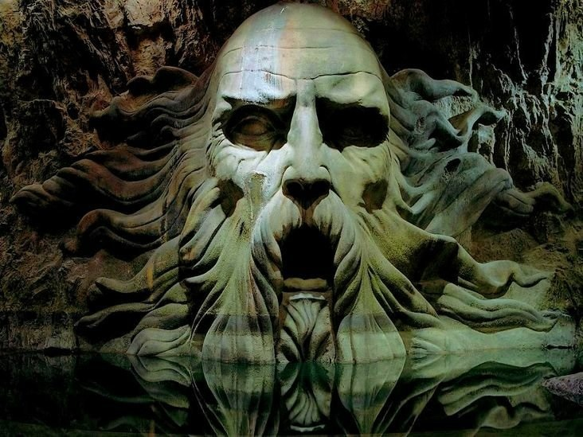

Поначалу Хогварст — по крайней мере в первых романах серии — представляется племенным поселением: символическая репрезентация Хогвартса, исполняемая самими его обитателями, не совпадает с тем, что можно было бы увидеть «извне», в качестве некоторого объективного или даже официального описания, что в целом соответствует проблеме, описанной еще Леви-Строссом (идеологическая картинка vs. картографический взгляд с вертолета). Официальная репрезентация изображает школу магов в виде содружества разных «домов», но с точки зрения повествования и его героев, само это содружество изначально расщеплено на два полюса — Гриффиндор и Слизерин, причем, поскольку исходно от читателя требуется отождествиться с героями (Гарри и его друзьями), только позиция Гриффиндора представляется легитимной, тогда как Слизерин выглядит едва ли не домом изгоев, по странной случайности претендующим, однако, на господство. 

Но эта оппозиция смазывается наличием двух других домов или башен, Рэйвенкло и Хаффлпаффа. Почему Хогварст не может стать обычной двухпартийной системой, в которой две партии лишь внешне радикально отличаются, исключают друг друга потому именно, что они слишком друг на друга похожи (аналогичное сходство вплоть до отождествления обосновывает сюжет отношений Гарри Поттера и Воландеморта). Возможно, что Хогварст уже движется к двухпартийной системе, однако мы наблюдаем его на полпути, в некоторой точке, где два других дома вытеснены на обочину, а потому их идеологическая функция остается непонятной: они неизбежно сдвигаются к позиции сопровождения, союзников, растягиваются по полюсам Слизерина и Гриффиндора. Рейвенкло — опциональный союзник Слизерина, Хаффлпафф — Гриффиндора. В этой логике возникает легко узнаваемая игра гегемонических претензий: Слизерин и Гриффиндор отстаивают совершенно разные концепции не только Хогвартса как учреждения, но и магии в целом, причем именно позиция Слизерина оказывается маркирована: он находится в положении радикального исключения, «другого», грани, точки (не)возможности, которая всегда маячит на горизонте, что не мешает ему претендовать на гегемонию. Позиция Гриффиндора — это, по сути, позиция нормы, статус-кво, которая настолько хорошо интериоризирована теми, кто в эту норму уже включен, что не требует обсуждения. Само членение Хогвартса на четыре дома в этом случае представляется нормой, установленной и поддерживаемой Гриффиндором, тогда как Слизерин, возможно, разделил бы магическое сообщество иначе, или даже не стал бы делить его вовсе. Гриффиндор допускает разделение, сортировку, как она есть — то есть скорее как магический ритуал, не имеющий принципиального значения (что-то вроде разделения на классы А и Б), предполагая, что даже Слизерину в ней найдется место, тогда как Слизерин, видимо, стремится к состоянию без сортировки — что в определенном смысле является радикализацией самого принципа единства магического мира и магии в целом. Все маги должны составить один корпус, тогда как с точки зрения Гриффиндора внутреннее разделение магов является техническим, непринципиальным, проходит по разделу «учебной части», субкультуры alumni и т.п. В этом смысле «дома» Гриффиндора и Слизерина — или само основание разделения домов — не совпадают: в первом случае возникает эффект технизации и тривиализации некоторых различий, которые не закрывают путь для дальнейшей карьеры. Дома оказываются способами символического облагораживания и приукрашивания учебно-административных задач, «командами», нужными для стимулирования конкуренции учащихся, которые выбираются достаточно произвольно, поскольку все студенты учат одно и то же (что подчеркивается совместными занятиями Гриффиндора и Слизерина у многих преподавателей, в том числе Снейпа), то есть выбор дома является выбором «буквы» (А, Б, В), flavor, легкой коннотации пристрастий и способностей студентов, каковой выбор никак не сказывается на дальнейшей карьере (исторически подчеркивается наличие разных карьерных путей у выпускников разных домов). Во втором случае, Слизерина, само различие на дома и соответствующая сортировка представляется незавершенным конфликтом, аппаратом маскировки антагонизма в понимании самой логики различий. Использование различий «по способностям и склонностям» указывает, с позиции Слизерина, на сокрытие главного различия: магов и не-магов, которое Слизерином понимается в ультраконсервативном и расистском смысле, как принцип pure blood.

«Актуальное» (по хронологии «вселенной Поттера» — конец 1990-х) состояние романа соответствует, таким образом, стандартному политическому пониманию логики различий. Оба ответа, представляемых Гриффиндором и Слизерином, отвечают на вопрос — «зачем нужны различия» и «что они собой представляют», однако эти ответы не покрывают друг друга, удерживаясь в асимметрии. Гриффиндор мыслит различия эмпирически, практически и в то же время по-фетишистски, чем пытается утвердить свою фактическую гегемонию, уже оспоренную, однако, идеологически: хотя мир магии — это мир Гриффиндора, его можно оспорить тем, что сами различия внутри Хогвартса принимаются им за данность, нечто такое, чего могло бы не быть, но пока наличие различий не является источником большого вреда, если только они остаются техническими и культурными. По сути, Гриффиндор выступает за культурные, условные, конвенциональные различия, которые нужны для удобства, но ему всегда предъявляют претензию, состоящую в том, что он тем самым вытесняет более глобальное различие — магов и не-магов. Не потребует ли инклюзивность Гриффиндора в конечном счете допускать в него — хотя бы для ознакомления — и маглов, пусть и в статусе сквибов? Но в целом Гриффиндор не видит проблемы в том, чтобы «быть магами»: сообщество магов солидарно в себе и в определенной мере солидарно с маглами. Слизерин же в конечном счете отстаивает принципиально иную политику различий, которая основывается на единстве в исключении: маги исключительны, это отдельный гегемонический вид, соответственно, различия между домами теряют значение — они существуют только как уступка самому ограничению магии.

Проблема, однако, в том, что эта «нормализация» в системе двух непримиримых (но в конечном счете стремящихся к одному, к единству магии) партий осложняется не только невозможностью выписать в полном виде само это столкновение (Слизерин лишь подозревается в своем радикализме, Гриффиндор занимает промежуточную позицию культурной гегемонии, но не готов к полной инклюзии), но также и генеалогией самих «домов». Логика различия и оппозиции обременена генеалогией, которая не сводится в полной мере к идеальному противостоянию либералов-гриффиндоров и ультраконсерваторов-слизеринов. Генеалогия раскрывается в «песне сортировочной шляпы» в «Ордене Феникса» (то есть на довольно позднем этапе повествования). Основатели школы — маги С. Слизерин, Г. Гриффиндор, Х. Хаффлпафф и Р. Рейвенкло — изображаются лучшими друзьями, содружеством основателей («отцы-основатели», framers), причем с одной стороны это парад друзей — Слизерин и Гриффиндор, с другой — подруг, Хаффлпафф и Рейвенкло. Однако в самом акте основания они заявляют разные принципы «обучения», отбора абитуриентов — Слизерин с самого начала в качестве принципа обучения полагает чистое происхождение, the purest ancestry. Рейвенкло основанием отбора провозглашает интеллект (whose intelligence is surest), или, в других вариантах, wit, остроумие и находчивость. Гриффиндор, в формулировке шляпы, задает критерий, который в этом списке оказывается наиболее проблематичным — он собирается учить только тех, кто «with brave deeds to their name». Тогда как Хельга Хаффлпафф готова учить всех остальных и, более того, the lot, and treat them just the same. Таким образом, акт основания, хотя он и совершается четырьмя друзьями-основателями, уже разорван принципами, которые вступают в конкуренцию друг с другом, требуя разного определения сообщества магов (или по крайней мере его академического воплощения). Само основание Хогварства как четырех домов представляется, соответственно, не столько сложением четырех фигур основателей, взаимодополняющих друг для друга (или разных специализаций), сколько компромиссом, который, по сути, ущемляет проект Хогвартса: вместо единства, руководимого каким-то одним принципом, мы получаем промежуточное решение — каждому по дому, так что внутри Хогвартса реализовано четыре разных Хогвартса. 

Важны также некоторые детали формулировки этих принципов. Слизерин требует не просто «чистой крови», но чистейшего происхождения, что даже радикальнее позиции «современного» дома Слизерин и Воландеморта. Возможно, Слизерин с самого начала требует пуризма, который должен реализовываться внутри «чистокровных», и в таком случае современный дом Слизерин вынужден продолжать ту же политику в гораздо менее выгодных условиях (когда приходится бороться с «грязнокровками»). Но противоположностью Слизерина в этой схеме учреждения Хогвартса оказывается не Гриффиндор, как можно было подумать, если исходить из его актуального состояния, а Хельда Хаффлпафф, которая требует равенства и одинакового отношения ко всем. Позиция «дома Хаффлпафф» оказывается, таким образом, позицией универсальности, которая была вытеснена в исключение, в самый слабый дом, который имеет два выражения — «все» и «остальные» (the lot и the rest). Хаффлпафф отстаивает принцип «добра» (good), тогда как все остальные выдвигают формальные критерии отбора, которые, однако, оказываются категориально разными и не могут конкурировать друг с другом напрямую. Наиболее противоречиво выглядит позиция Гриффиндора — принцип «славных дел, которые есть у имени» оказывается вариантом слизериновского концепта «чистейшего происхождения», то есть не столько альтернативой, сколько другим определением ancestry. Собственно, purest blood Слизерина не обязательно означает исключительно «расовый» принцип — им заранее предполагается, что наиболее аристократичные семьи магов являются и наследниками наиболее славных дел (для расцепления этого равенства заслуги и крови в последних томах вводится сюжет семейства Марволо Гонта, прямого потомка С. Слизерина, но при этом типичного white thrash, не отличившегося никакими славными делами). В оппозиции Слизерин/Гриффиндор скрывается лишь дискуссия по поводу более адекватного определения благородства: через кровь или через славные дела, аналогичная, например, дворянству шпаги и дворянству мантии, то есть само дворянство под вопрос не ставится. В первоначальной формулировке принцип Гриффиндора представляется столь же наследственным, однако потом уточняется — в Гриффиндор отбираются не те, кто располагает списком «brave deeds to their name», но попросту «the bravest and the boldest who went to daring Gryffindor». То есть остается определенное пространство для различных выскочек и арривистов, но они подверстываются под слизериновское определение благородной крови. «Наследие» славных дел не равно «максимальной смелости» как качеству студента, в том числе потому, что не вполне понятно, как его выявить, если не по каким-то будущим поступкам. Несомненно, Гриффиндор предлагает не просто более широкий, но иной принцип отбора, в пределе указывающий на качество, которое не может быть определено однозначно (не значит ли это, что в Гриффиндор принимаются все, кто только достаточно смелы, чтобы претендовать на это?), однако само это расхождение формулируется как альтернатива принципу Слизерина. Формула Гриффиндора остается альтернативой Слизерину, но именно «в его логике», тогда как реальная альтернатива представлена только Хаффлпафф. В этой конструкции Рейвенкло выступает в качестве не альтернативы Слизерину и всем остальным, а миметического подобия: если сопровождающей коннотацией Слизерина и чистоты крови представляется хитрость и лукавство (cunning), то Рейвенкло принимает в качестве принципа отбора их синонимы — intelligence и wit, то есть более нейтральные термины, которые, однако, являются, по сути, дополнением к отбору Слизерина. Таким образом, первичный акт учреждения организуется в виде расщепления между Хаффлпафф и всеми остальными (то есть между «всеми» и «всеми»), собранными, в свою очередь, под символическим господством Слизерина, заявившего то, что аристократический отбор лучших необходим. Хаффлпафф представляется тогда наиболее пассивным домом и принципом, куда попадают все те, кого больше некуда девать (тогда как сама Хельга Хаффлпафф оказывается странным основателем, который просто не желает предъявлять никакого принципа отбора).

Таким образом, акт учреждения оказывается в то же время актом подрыва, в котором выдвигаются разные принципы самого этого основания, распределяемые между символическими полюсами Слизерина и Хаффлпаффа. Двусмысленность такого основания проявляется в несколько путаной истории (непосредственно после основания), которая рассказана шляпой, то есть истории «диктатуры» основателей. На первом этапе найденное решение — четыре Хогвартса в одном — позволяет сохранить дружбу и организовать гармоничное единство, но тут же начинается вражда «башен» (pillars), которая прямо противоречит исходному замыслу. В этом нарративе шляпа неявно указывает на то, что промежуточное, компромиссное решение — четыре «дома» — начинает пониматься в качестве условия гармоничного схождения, то есть как исходный дизайн, предложенный основателями, не в качестве промежуточной точки конфликта, а в качестве конечного решения, позволяющего удерживать их совместность в общем проекте. То есть это одновременно и след неустраненного конфликта, и способ сохранять общность в условиях невозможности выбора окончательного варианта. 

Здесь можно отметить то, что учреждение Хогвартса никогда не концептуализируется в качестве принципа разделения способностей, дополняющих друг друга, на что могли бы указывать многочисленные слоганы самих домов, да и сама процедура сортировки, осуществляемой шляпой. Post factum разделение домов могло бы пониматься как возможность не просто дружбы основателей, но и как возможность органичного распределения способностей, которыми «естественным» образом различаются ученики. Однако Хогвартс никогда прямо не подписывается под этой логикой «взаимодополнительных способностей», поддерживающей сказочные сюжеты, где один герой может сделать что-то одно (затушить огонь водой), а другой — другое (выпить воду). Последний принцип осуществляется, например, в таких достаточно не-волшебных текстах, как «Оно» Кинга, где в группе «лузеров» способности распределены по принципу взаимодополнительности — и все они имеют исключительный характер (физическая ловкость на грани магии, способность ориентации в пространстве, вполне светская архитектурно-конструкторская способность и wit будущего писателя). Группа складывается как единое многофункциональное и почти неуязвимое тело, в которое каждый вносит свои способности. В Хогвартсе такая логика остается лишь идеологической возможностью, никогда не реализуется на практике, поскольку она не имеет ничего общего с процессом учреждения, в котором друг с другом сталкиваются разные принципы основания. Шляпа отмечает, что только смерть С. Слизерина позволила Хогвартсу перейти к относительно мирному существованию, в котором противоборство домов было сглажено — что также указывает на то, что искомый «мир» домов парадоксальным образом достигается лишь тогда, когда исключается претензия одного, наиболее последовательного и радикального, основателя, и Хогвартс приобретает форму «4-1», в которой один дом всегда под вопросом, тогда на самом деле из него исключен не Слизерин, заложивший основание, а Хаффлпафф — принцип универсальности. 

«Исходная ситуация» основания, хотя она и реализуется, как может показаться, лишь в рамках «учебного учреждения», на деле показывает сложность всякого основания. Дело в том, что, как подразумевает Слизерин, всякое основание — это отбор. Сообщество магов должно быть меньше сообщества магов, и, наоборот, сообщество магов всегда больше сообщества магов. То же самое относится, разумеется, не только к магам. Вопрос в том, как основать, не выбирая и не отбирая. История основания Хогвартса показывает, что любой договор лишь скрывает ситуацию отбора, которая как раз и полагается здесь в качестве первоначальной, но структурно, разумеется, не способной пониматься в качестве абсолютного начала (поскольку на момент основания маги уже существуют, и точно так же на момент основания любого сообщества какое-то сообщество, общество, множество уже существуют). Абсолютное начало Хогвартса оказывается более «начальным», чем контрактные теории потому именно, что оно не мыслится в качестве такого начала, что и позволяет этому сценарию обнаружить то, что существует прежде идеологического конструкта договора. Действительно, договор в истории Хогвартса является «реальным», а не мифическим основанием, то есть именно он вступает в дело тогда, когда первоначальный «отбор» так и не состоялся. Таким образом, во вполне деконструкционистской логике откладывания «начала», «первое начало», начало-до-отбора и до самой возможности выбора/основания никого не интересует, значение имеют две конкурирующих логики — отбора и соглашения, причем вторая замещает первую тогда, когда по поводу первой договориться не вышло. Поскольку сообщество магов не удалось основать путем строгой селекции, которая бы оставила часть магов вне основываемого таким образом сообщества, в дело вступает второй механизм — компромиссного договора разных домов, каковой на самом деле представляется не чем иным, как сложением четырех разных принципов отбора внутри «одного» Хогвартса, то есть объектом, состоящим из разных способов построения самого этого объекта, вытесненных в виде отдельных «частичных» объектов. Конечно, «договор», оказываясь компромиссным, сам разбивается на две части — несостоявшегося договора (по поводу принципов отбора) и компромиссного, но это не позволяет вынести его в трансцендентальную позицию по отношению к отбору — договор никогда не сходится с отбором, и наоборот. 

Как основывать не выбирая (и, соответственно, не исключая)? Позиция Хаффлпафф, казалось, дает ответ на этот вопрос, однако на деле он остается негативным: не выбирать можно тех, кого уже не выбрали. Универсализм Хаффлпафф требует такой открытости, которая грозит стереть акт основания: если, в конце концов, Х. Хаффлпафф готова учить всех и каждого, неясно, зачем ей нужна школа и собственный дом. Точно так же все остальные отцы-основатели могли бы практиковать обучение безо всяких школ, что видимо и происходило (и что в современном Хогвартсве осуществляется в виде не вполне легальных уроков Люпина и самого Гарри в «Армии Дамблдора»). Универсализм оказывается в зависимом положении потому именно, что он сам мыслит себя в качестве идеального договора, не замечая того, что договор вступает в действие в лучшем случае на втором этапе, когда «уже» не удалось отобрать, как и того, что даже внешне некомпромиссный договор требует бескомпромиссности состоявшегося отбора (например, отбора по принципу рациональности — и тогда, возможно, позицию общественного договора представлял бы дом Рэйвенкло). Радикализм Хаффлпафф заключается, однако, в пропуске обеих замещающих друг друга фигур — отбора и договора — как фигур основания, и поэтому он остается с негативным содержанием, да и, по сути, в позиции исключения, в которой the lot — это никто, те, кто не имеет никакой роли. Сама возможность «принять всех» требует определенной возможности допуска куда-то, то есть прием невозможно отделить от ограничения, даже если не полагать его в качестве формального «приема» (в учебное заведение и т.п.), даже если это всего лишь смена символического статуса, метки (гражданства, состояния и т.д.).
