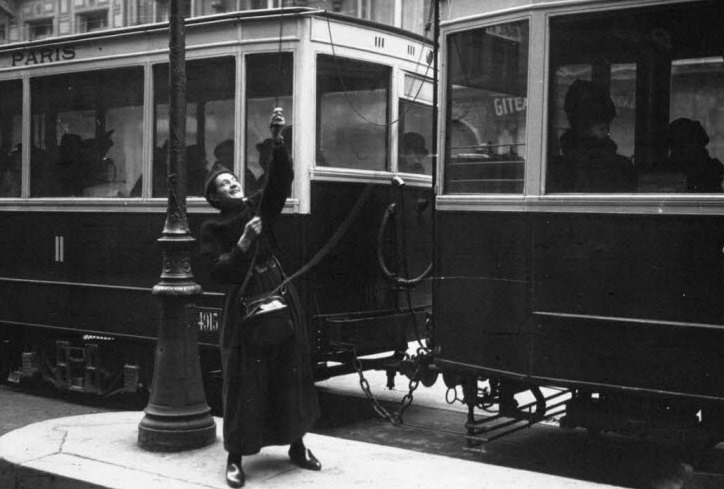

Принцип развития всевозможных интерфейсов, начиная с приложений и заканчивая службами «одного окна», часто формулируется как требование гладкости, отсутствия трения. Алгоритм действия должен быть построен так, чтобы в каждом пункте одно действие логично вытекало из другого, то есть чтобы на отдельных этапах не возникало слишком много развилок. Требование это не такое и невинное: гладкость создает логистический контур, в котором агент лишается ощущения самостоятельности и целенаправленности, возникает своего рода дереализация: ты просто проходишь определенные этапы, сортируешься, как чемодан в аэропорту или посылка на почте. Индивид в такой гладкой среде должен функционировать в качестве считывающего устройства, знаки дорожного движения уже не требуют длительного предварительного обучения. Стоит только понять такой знак неверно, выбрать неправильное направление, и вскоре вернешься к исходному пункту, сделав лишний круг. Индивид, он же посылка или заказное письмо, быстро учится тому, как работать правильным считывающим устройством, поскольку наказание состоит в промедлении, зацикливании, возвращении к исходной точке.

Подобные циклы — важные составляющие гладкости, инструменты обучения, обеспечивающие ее за счет обратных связей разного уровня. Но есть в ней регуляторы и другого толка — те, что требуют субъективации, чуть ли не поступка. Например, кнопки. Последние были придуманы в XVII веке окказионалистами, философами, которые вслед за Декартом решили, что между душой и телом не может быть никакой коммуникации, связи или передаточных узлов. Когда я поднимаю руку, я на самом деле не могу ее поднять, это иллюзия, поскольку между душой и телом нет сродства, нет точки пересечения, а потому рука поднимается сама по себе, по неизвестной мне причине. Тем не менее, она поднимается, когда я ее поднимаю — факт остается фактом. Окказионалисты считали, что есть инстанция, скажем, Бог, которая знает о том, что я хочу поднять руку, а потому подыгрывает мне, поднимая ее, то есть тело является марионеткой Бога, но душе удобно считать, что это не так. Ей привычней закрывать на это глаза — пусть Бог делает свое дело, а я буду делать вид, что поднимаю руку. Точка желания, элементарного, несоизмеримого и в то же время фиктивного воздействия, производимого душой, — и есть простейшая кнопка, основанная на том, что действие одного порядка должно запускать действия какого-то совершенно иного порядка, нам не известного, приводя к наблюдаемому результату. То есть, когда мы нажимаем на кнопки, мы остаемся все теми же нематериальными, непротяженными душами в картезианском смысле: мы не знаем и не хотим знать того, что происходит на фоне, на другом конце, кто на самом деле дергает за ниточки и как именно.

Введение кнопочных интерфейсов там, где их не было, иногда не повышает гладкость, а, напротив, мешает и сбивает с толку. Вообще-то, конечно, гладкость должна повышаться: кнопка означает уменьшение усилий, сокращение их до простого знака. Там, где раньше надо было прикладывать силу или хотя бы «руководить», теперь достаточно даже не руки, а пальца. Палец способен на максимально гладкие, почти незаметные движения, поэтому кнопку можно поглаживать и ласкать, палец может замирать и парить над ней. Однако в том случае, когда ранее логистика осуществлялась в автоматизированном режиме, введение кнопочного интерфейса способно изменить всю схему действия в целом, породить душу и субъекта там, где их не было. Пример — московские трамваи и МЦК. В обоих введены кнопочные интерфейсы открывания дверей, хотя традиционно трамваи и электрички ничего подобного не имели. То есть стандартная ситуация была уже достаточно гладкой, трафик пассажиров был трафиком своего рода «посылок», объектов, которые загружаются и выгружаются без их ведома.

Автоматические двери абстрагируют систему транспорта от пассажиров — в том смысле, который опознается в пустом вагоне, в котором двери открываются и закрываются даже в отсутствие людей. В этом можно усмотреть модель социального устройства в целом: транспорт, логистическая и социальная система существует сама по себе, без людей, чем подчеркивается ее надежность, пусть немного суровая и депрессивная, ведь люди ей вроде бы и не нужны. Автоматические двери и лифты (в том числе и социальные) говорят о запасе неоптимизированности: неважно, воспользуетесь вы шансом или нет, они все равно откроются. Общество, в конечном счете, может обойтись и без людей, по крайней мере без этих конкретных людей. Конечно, зрелище понапрасну открываемых дверей внушает тревогу — непонятно, зачем гонять пустые вагоны или лифты. Это явное расточительство. Но оно же указывает на запас прочности: если лифты можно гонять и открывать пустыми, значит мы можем себе это позволить, значит есть вакансия. Автоматические двери — это фигура такой вакансии, для которой не нужен никто конкретно, что само по себе может удручать, но в то же время вакансия представляется, резервом, redundancy. В автоматически открываемую дверь можно пройти, проскочить, поскольку лично ты ей не важен. Ты для нее — по сути, заяц, но это большой плюс.

Совсем другое дело — кнопочные интерфейсы в общественных местах, в том числе в общественном транспорте. Они инициируют спектакль, сцену субъективации, порождения, пусть и мимолетного, душ в автоматизированном людском потоке, который ранее мог обособляться от механизмов транспортировки и социального трафика. Кнопка, особенно если она вводится там, где раньше ее не было, не сглаживает процесс, а, наоборот, помечает его в качестве того, что нельзя принимать за данность. Например, кнопку еще надо найти, на ней же обычно не написано, что это кнопка. На трамвайных остановках иногда еще можно заметить, как подошедшие к остановке люди не могут сесть в закрытую дверь, потому что не видят на ней кнопки и просто не подозревают, что есть такой интерфейс. В лучшем случае они успевают добежать до той двери, которую изнутри открыли другие пассажиры. То есть кнопка — воплощенная, материализовавшаяся двусмысленность: с одной стороны, она сглаживает и облегчает процесс, с другой, помечает его как задачу, которую еще предстоит решить, хотя в этом вроде бы и нет ничего сложного. Внезапно мы начинаем понимать, что есть какой-то хитрый механизм, с которым эта кнопка связана, и он еще только должен сработать, он не откроется сам по себе, и самое плохое, мы сами уже встроены в него, призваны к нему, нам только и остается, что взять под козырек, ведь кнопка не терпит уклонения, хотя сама легко может заартачиться.

"Женские профессии: восстановление контакта с трамвайной дугой", 1915 г.  Agence de presse Meurisse.

Последнее важно потому, что кнопка — не инструмент в привычном смысле слова, а скорее призыв выполнить некоторое символическое, оторванное от результата действие. Между открыванием дверей и нажатием кнопки нет никакой видимой связи, это может быть розыгрыш, фикция. Поэтому кнопка относится скорее к символическому порядку, то есть призывает, рекрутирует того, кому выпало ее нажать. Это минимальное, почти сакральное действие, которое само по себе ничего не значит, но вроде бы запускает цепочку действий, которая ведет к серьезным последствиям. Кнопка — то же самое, что «нос Клеопатры», о котором писал Паскаль: если бы нос был короче, мировая история сложилась бы иначе. Так и кнопки в трамвае — скорее носы Клеопатры, которые призывают пассажиров обратить на них внимание, то есть стать, наконец, не просто пассажирами, а вершителями своих судеб. Разница между прозаичностью действия (нажатием кнопки) и невообразимостью результатов — простейший залог субъективации, проявления со стороны каждого, кто нажимает кнопку, самостоятельности и совершеннолетия. Будьте ответственны, нажимайте кнопки.

Особенность этой субъективации в местах массового пользования в том, что она происходит вовсе не тет-а-тет, не в ситуации «человек против кнопки» или «человек, призванный кнопкой» как судьбой. Скорее, это сцена, в которой один открывающий, то есть нажимающий кнопку, неизбежно противостоит тем, кто вместе с ним выстроился в очередь на вход или выход — противостоит просто потому, что они другие. На этой сцене только он один субъективируется, выполняет свою миссию (на самом деле почти невыполнимую), тогда как остальным выпала роль зрителей, которые, однако, ревниво наблюдают за его деянием. Прозаический акт выхода из транспорта превращается в едва ли не театральный акт решимости и состязания, а то и позорного провала. Выстроившийся перед кнопкой хвост из пассажиров сам по себе, независимо от их желаний, указывает на фигуру ведомого и ведомых, первого и всех остальных, причем первый может стать первым как случайно, так и вполне осознанно. Там, где раньше все были более или менее равны, теперь выделяются те, что рвутся открывать двери, и те, что стараются этого избежать, стушеваться. Вторых легко заподозрить в том, что они не готовы себя проявить, субъективироваться на глазах у всего честного народа, да и вообще что-то решить — в конце концов, не за это они, покупая билет, платили.

Публика, сформировавшаяся на мгновение из пассажиропотока, внимательно следит за нажатием кнопки потому именно, что открывание дверей не должно стать заминкой, долгим и бессмысленным копанием. Все в общем-то помнят, как это было раньше, при автоматических дверях, всем знакомо это чувство гладкости, когда трафик от тебя не зависит. Соответственно, кнопка должна имитировать «старый порядок», а потому нажать ее нужно как можно быстрее, как только она активировалась. К тому же, очередь пассажиров знает, что не все знают о том, как это работает и что вообще есть кнопка. Отсюда общая нервозность: все уже приняли в расчет то, что не каждому известно то, что вообще-то должны знать все, а потому тот, кому выпала роль Человека у Кнопки, может оказаться лузером, неучем и неумехой. Сцена превращается в публичный выбор делегата на открывание кнопки, который, как хорошо известно избирателям, может провалить свое задание — и тогда его придется отзывать, суетиться, устраивая переворот у дверей вагона.

Делегат может сплоховать не только как поверенный пассажиров, но и в метафизическом смысле — не сумев вовремя открыть дверь кнопкой, он дезавуируется в качестве деятеля и, в конечном счете, души, а ведь ему выпал шанс! На какое-то время он был избранным, почти что Нео, спасающим очередь от заточения в душном вагоне, и вот он снова никто, его снова отодвинули и задвинули — и хорошо бы, если бы таких пассажиров не выпускали, по крайней мере до следующей остановки. Хуже того, ему могут помешать пассажиры извне, с остановки, которые тоже способны открыть вагон, опередить внутреннего делегата, то есть лишить его миссии и субъектности — и вот он уже не герой, а всего лишь исполнитель чужих решений.

Конечно, эти шероховатые сцены постепенно сглаживаются, а потом и вовсе становятся незаметными. Однако распределение таких позиций — субъективации, публики и делегата, провала и удачи, — все равно сохраняется там, где раньше ничего подобного не было. Кнопки нужны для того, чтобы можно было призвать кого-то к ответу, сказать ему, что от него что-то зависит, но сама эта зависимость и сама сцена действия остаются фиктивными: мы так и не узнаем, могли ли двери открыться без нас, была ли кнопка сделана только для нас и ни для кого другого, ведь нельзя же применять в тех же трамваях кнопочные интерфейсы, активируемые отпечатком пальца.

Впрочем, это была бы хорошая антиутопия, сейчас уже вполне реализуемая. Фиктивность ответа кнопки уже создает возможность проверки, теста, выполняемого ею, ведь видимость агентности самой кнопки была исходно заложена в сам ее «механизм», не являющийся в прямом смысле слова механистическим. То есть кнопка получает самостоятельность не там, где она явно отвечает, а там, где она «молчит», то есть там, где возникает ситуация неразличения между ответом и отсутствием ответа: в этот неприятный момент мы не знаем, кнопка уже не сработала или мы пока просто ее не нажали. Эта неразличимость сама по себе создает возможность для различия модернистских кнопок и постмодернистских: первые все еще притворятся механистическими устройствами, в которых вся вина неизменно возлагается на субъекта, который может нажать не так, как надо. Это воспитательные, дисциплинарные кнопки. Тогда как постмодернистские кнопки сами становятся оценивающим, умным интерфейсом, проверяющим субъекта на его субъектность, платежеспособность, лояльность и т.п.* Простого взаимодействия оказывается недостаточно — кнопка сама решает, состоялось ли оно, причем резоны, принимаемые ею в расчет, могут быть какими угодно. Системы квантификации социального рейтинга показывают возможности такого дизайна интерфейсов, в которых любое взаимодействие создает эффект заведомого провала агента: возможно, ему стоит заранее подкупить кнопку, чтобы действие состоялось. Умная кнопка вполне может завести свой собственный счет в банке и ждать поступлений от очередного претендента на взаимодействие с ней, оставаясь до момента пополнения этого счета в бездействии. Если в модернистскую кнопку встраивалась логика обучения и дрессуры, то в постмодернистскую — скорее логика системной коррупции. Не подмажешь — не поедешь.
