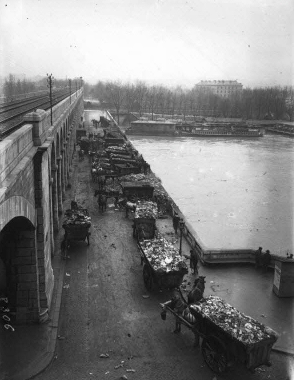

В 2017 г. в Кении [вступил](https://www.bbc.com/news/world-africa-49421885) в действие строгий запрет на производство, использование и распространение бытовых пластиковых пакетов — штраф до 40 тысяч долларов или тюремное заключение сроком до 1 года. Задача властей, впрочем, состояла не в том, чтобы разобраться с «тихоокеанским мусорным пятном», а в том, чтобы в желудки коров попадало меньше пластика. Но не только в Кении, но и во всем мире, пластик становится врагом номер один, так что даже степень экологической просвещенности можно оценивать по более или менее нетерпимому к нему отношению. Под ударом оказался самый модернистский материал, в каком-то смысле более модернистский, чем стекло, бетон и сталь. Возможно, отказавшись от пластикового пакета, мы уже не сможем быть самими собой, теми, кем мы были в XX веке, да и само выражение plastic fantastic, несколько ироничное, но охватывавшее множество областей, от быта до косметической хирургии, потеряет смысл. С момента [своего изобретения](https://www.bbc.com/news/business-42646025) пластик самой своей структурой символизировал новое серийное производство: повторяемость простых органических составляющих в длинной полимерной цепочке как нельзя лучше соответствовала принципам конвейерной сборки. Впоследствии выяснилось, что мы и сами «фантастический пластик», поскольку ДНК тоже представляет собой полимер, пусть и более сложный. Но мы — пластик не только в таком буквальном, биологическом смысле, в каком-то отношении сама наша психическая конституция имеет пластиковый (а не только пластичный, как часто говорят) характер.

Попытки разобраться с пластиком, превратить его в материал-козла отпущения скрывают сложную психическую экономию, которая определяется уже самим его противоречивом статусом. Пластик — это мусор, в котором хранится, контейнируется, изолируется другой мусор, то есть это мусор, который делает мусор управляемым, чистым, изолируемым и наблюдаемым. Ирония пластика в том, что для защиты от биологического и химического мусора, для внедрения элементарных правил санитарии, понадобилась бесконечная вечная пленка: чтобы отделаться от чего-то как нельзя более временного и преходящего, от отходов нашей жизнедеятельности и промышленности, нам нужны едва ли не вечные материалы. Вопрос сегодня в том, как избавляться от временного и бренного, если за это приходится платить вечным?

Сама по себе фокусировка на бытовом мусоре — с его обязательной сортировкой — говорит об определенной доместикации антропоцена, то есть глобального потепления и вымирания видов. Это можно понять, если сравнить дискурс, подчеркивающий важность внимательного отношения к собственным отходам, с классическим зеленым дискурсом, как он формировался в политике 1960-1970 гг., когда экологические проблемы рассматривались как компонент управления государством всеобщего благосостояния. Собственно, «устойчивое развитие» обещало, что человечество будет бесконечно долго пользоваться собственной средой, если сможет правильно выстроить свой производственный цикл. Современные исследователи [говорят](https://www.cambridge.org/core/books/invention-of-sustainability/DA31E7325BE2A33EBBA19C4089244A13) поэтому, что «устойчивость» — это всегда экология с антропоцентрической позиции управления и регулирования, поскольку само это понятие было перенесено из таких областей, как лесоводство и рыбный промысел. Рыба и леса существуют для того, чтобы давать устойчивый приплод, которым человечество сможет пользоваться неопределенно долго. При таком антропоцентрическом подходе мусор — лишь наиболее заметная часть проблемы, внешний симптом, с которым работать довольно бессмысленно (собственно, и сейчас львиная доля пластика — не пакеты из продуктового магазина).

Современные этические, то есть бихевиориально-экономические программы заботы об отходах, следующие парадигме nudge, появляются, когда от экологии устойчивости пришлось отказаться, в том числе и по политическим причинам. Экологическая озабоченность встраивается сегодня в паттерны бытового поведения методами социальной инженерии и либерального патернализма именно потому, что она играет роль, прежде всего, терапевтическую: нельзя наделить людей сознанием антропоцена и в то же время оставить их привычки неизменными. То есть сортировка мусора — это, как говорят психоаналитики, работа траура — траура по потерянной иллюзии «природы», «равновесия» и устойчивости, с той лишь поправкой, что работа траура должна когда-то закончиться, чего в случае мусора не предвидится. Само выделение «мусора» как локуса «экологической проблемы» говорит о том, что это именно то место, в котором эту проблему может увидеть индивид — но это же означает, что больше ее, по сути, видеть некому, то есть именно индивид делегируется теперь в качестве привилегированного наблюдателя «экологических проблем» и в то же время инстанции, за них ответственной. Все остальные механизмы, включая межгосударственные, будут раз за разом призывать его к его собственному мусорному ведру — чтобы занять его «сигнализированием добродетели» и в то же время расписаться в собственной несостоятельности. Ведь, зачем заключать соглашения, если люди будут по-прежнему «мусорить»?

Закат классической зеленой политики означал необходимость ее отыгрывания на индивидуальном, идеологическом уровне: если мы не можем ничего сделать как коллектив и если мы на самом деле и не коллектив вовсе, давайте каждый будет делать хоть что-то в индивидуальном порядке, следить за собой и за соседями. Этический императив опознается по интерпелляции, призывающей к ответу индивида как такового: не надо кивать на соседа или на миллион лет эволюции человека, разберитесь сначала с мусором у себя на кухне (то есть у себя в голове)! Начните с малого, следите за собой и т.д. Вопрос не в том, плохо это или хорошо, а в том, насколько это релевантно «антропоцену». Произошел интересный поворот: точно так же, как последствия банковского кризиса были списаны на обычных граждан, расплатившихся мерами austerity, за глобальное потепление призваны расплачиваться отдельные потребители, которые отныне должны заботиться о собственных отходах, что, конечно, меняет само понятие отходов и мусора. Можно заметить, что этичность подобных программ сама определяется тысячелетней историей западных психических и моральных техник. Так, первые христиане, о которых много писал Мишель Фуко, практиковали постоянный надзор за собственным сознанием, отслеживали мимолетные мысли, в которых необходимо исповедоваться своему наставнику или самому себе. Эта практика, являвшаяся развитием стоических техник эллинистического периода, задает своего рода замкнутый психический контур, «полный цикл», в котором ничего не пропадает и в то же время ничего не появляется из ниоткуда. Христиане предполагали, что источником всякой мысли является в конечном смысле божественное или дьявольское начало. Секуляризация этих практик в Новое время означала то, что субъект становится безотходной инстанцией, тем доменом реальности, в котором он может поддерживать замкнутый цикл с самим собой (по образцу картезианского cogito) и не выходить за собственные пределы. Главное, что в таком цикле не может быть собственно «отбросов» и мусора, в нем все проходит утилизацию, в каждой мысли можно отчитаться и каждую можно возвести к ее началу. Когда Декарт задумывается о том, какие идеи попали в его разум без его ведома, он, по сути, восстанавливает такой замкнутый цикл, безотходное производство: посторонние идеи выступают мусором, от которого нужно избавиться, тогда как внутренний мусор, заблуждения и иллюзии, поддаются в конечном счете полной реутилизации — они либо нейтрализуются, выводятся за скобки, либо получают объяснение, либо используются как сигналы той или иной истины.

Таким образом, современные практики потребительской, либерально-патерналистской экологии, ставшие предметом социального проектирования и маркетинга, содержат в себе определенную субъективную ставку, то есть вопрос не просто в том, «как меньше мусорить», а в том, кем мы станем, если в нашем мире вообще появится такая «вещь», как мусор, как изменятся координаты нашей психической экономии, если учесть, что образцом для нее долгое время оставались практики такого безотходного субъекта. Сортировка отходов — прежде всего, попытка решать этическими или даже церемониальными, ритуальными жестами то, что не поддается таким решениям, просто потому, что антропоцен начинается не в вашем мусорном ведре. Фокусировка на потребительском мусоре сама говорит об антропологизации антропоцена: сеть планетарных отношений и будущих катастроф, которые и получили название «антропоцена», сводится к хорошо знакомой бытовой картинке, человеку или ребенку (явно несмышленому), который «мусорит», «оставляет за собой», «пачкает(ся)». В социальных программах, нацеленных на внедрение разборчивого отношения к мусору, запрятан легко узнаваемый императив инфантильного толка — первичное приучение к чистоте. То есть потребитель, говоря опять же в категориях элементарного психоанализа, возвращается к «анальной» стадии, на которой главное — то, что выходит из него, что покидает его в качестве отхода, который одновременно беспокоит и приносит удовольствие. Субъекта призывают следить за тем, чтобы он не пачкал, вернее, чтобы научился пачкаться правильно, и он даже готов вернуться к этим задачам, впасть в детство, чтобы снова сдать тот же экзамен — в конце концов, когда-то он этому уже научился.

Таким образом, в первом приближении субъект, заботящийся о мусоре, или субъект, в мусоре разбирающийся, оказывается конструктом, собранным из осколков генеалогии западного субъекта как такового. С одной стороны, такая конструкция пользуется ресурсами практик самосозерцания, возникших еще в начале нашей эры. В данном случае они приобретают несколько парадоксальный оттенок: внимание требуется обращать на то, что, вообще говоря, должно было оставаться без внимания, вычеркиваться и как можно быстрее удаляться, эвакуироваться. Психическая экономия всегда требовала способов различения того, что следует удерживать, и того, что надо выбрасывать, изымать из собственной психической циркуляции. Например, многочисленные «страсти», основанные, по версии стоиков, на неправильном понимании субъектом своего места в мире, сами выступали своего рода мусором, который нельзя удерживать «в» субъекте. Кое-что в себе держать нельзя, но и просто «выбросить» гнев или страх из своей психики тоже нельзя, и в этом вся проблема. Избавиться от психического мусора можно только путем его нейтрализации и консервации, то есть мусор может сохраниться, но он должен перестать действовать в таком качестве, например, страх, должен перестать пугать. Причиной страстей — или, если в современном варианте, ложных привязанностей, фиксаций, руминаций и т.п., — объявлялись различные интеллектуальные ошибки, а потому субъект оказывался машиной по обработке и утилизации ошибок. То есть субъект — это, если воспользоваться термином из прграммирования, буквально «сборщик мусора», garbage collector, который постоянно высвобождает свою память и сознание от остатков неверно проведенных процедур, от ненужных объектов, но сама его способность к самоуправлению (то есть сборке мусора) говорит о том, что его психический цикл замкнут: в конце концов, когда субъект освобождается от страстей и ошибок, последние никуда не выбрасываются и не деваются, не вываливаются вовне и не спускаются в другого субъекта, хотя вполне допустимо представить такую фантастическую онтологию, в которой избавиться от ошибок и страстей можно, если только действительно подкинуть их соседу (или передать в какой-нибудь государственный репозитарий). Психический мусор хорош тем, что это не тот мусор, который надо выбрасывать, он может быть устранен в самом себе, в самом психическом производстве замкнутого цикла. Тогда как в собственном, незамусоренном внутреннем пространстве субъекта должны были оставаться лишь начищенные до блеска принципы правильного поведения, которые призваны срабатывать автоматически, при всяком поползновении на производство ошибки и мусора, то есть при всяком намеке на зависть, страх и другие страсти. 

Другой элемент генеалогии такого субъекта — принципы индивидуации, привязывающие субъекта к его собственным отходам на уровне научения практикам «не-пачканья». Ирония здесь в том, что, хотя официально антропоцен признается следствием коллективного действия человечества как вида, справляться с ним предлагается не просто на индивидуальном уровне, но за счет актуализации индивидуализирующих техник, отсылающих к сенсориуму стыда и других подобных чувств. Существовала антропологическая байка, использованная в свое время Делезом и Гваттари, о том, что индивид как индивид появляется только тогда, когда начинает заботиться о собственных выделениях и испражнениях, то есть когда его можно спросить — «кто это сделал?», «кто наделал эту кучу?» и когда он на такие вопросы начинает отвечать. Тот же самый механизм используется в бассейнах при добавлении красителя, реагирующего на мочу, — но, как известно, ничего реального добавлять не нужно, достаточно мифа о том, что такой краситель существует и добавляется, чтобы купальщики не забывались и не сливались с водой, то есть к воде добавляется не краситель как таковой, а мысль о нем. Подобный простейший субъект конструируется как ответ на интерпелляцию со стороны собственного мусора, что уже задает трудноразрешимую ситуацию: с одной стороны, субъект должен признать отходы собственной жизнедеятельности в качестве именно «своих», поставить под ними подпись, с другой, эта подпись ставится для того именно, чтобы он куда-то эти отходы убрал, что-то с ними сделал, чтобы они не оставались у всех на виду. Соответственно, публичное — это пространство, в котором за отходы каждого отвечает в частном порядке индивид, становящийся самим собой именно в акте такого признания/устранения. Он должен признать собственные отходы в качестве зависящих от него и ни от кого другого, в качестве собственного дела и собственной заботы. Нельзя не заметить, что все это требует сложных интеллектуальных процедур и абстракций, например, умения отождествлять действия собственного тела с «самим собой», то есть, в частности, видеть в актах своего тела действительно собственные действия, за которые можно отвечать.

Вопрос этической и психологической экономии субъекта в эпоху борьбы с пластиковыми пакетами и раздельного сбора мусора сводится к тому, можно ли использовать опробованные инструменты для решения беспрецедентных задач. Сегодня утверждается следующая «фигура», уравнение субъекта: заботится о себе — значит заботится о собственных отходах, о своем мусоре, а заботиться о собственных отходах — значит заботиться о мире в целом, вносить свой вклад в предотвращение климатического коллапса. Оба этих уравнения стягиваются в одно (заботиться о себе — значит предотвращать глобальное потепление), и оба покоятся на собственно пластике как возвышенном материале, материале-симулякре. Пластик — наиболее удачный вещественный коррелят субъективных техник изоляции, нейтрализации и сбора когнитивного мусора, то есть материал, который остается внешним для всех остальных материалов, выступая эфемерной пленкой, одновременно оформляющей и дистанцирующей, удерживающей. По большому счету, античный субъект в версии Фуко уже перешел к собственной пластификации: задача не в том, чтобы не допускать никаких страстей и ошибок, а в том, чтобы нейтрализовать их, произвести по отношению к ним процедуру остранения, которая отделяет их от нас самих тонким невидимым экраном. Остранить — значит завернуть в пластик. Наши ошибки на самом деле и наши, и не наши, буквально как мусор, сложенный в пластиковый пакет. В Кении под запрет попали и так называемые [«летучие туалеты»](https://en.wikipedia.org/wiki/Flying_toilet) — пластиковые пакеты, используемые в быту для избавления от экскрементов там, где собственно туалеты для большой части населения недоступны. То есть императив санитарии и индивидуации тут уже действует, но из-за отсутствия канализации приходится пользоваться пластиком как простейшим устройством дистанцирования, эвакуации: пластик чудесным образом оставляет все как есть, но в то же время нейтрализует, подвешивает ситуацию до лучших времен, которых, правда, уже не дождешься. Иными словами, для нас все, что существует «до» пластика, до процедур субъективного и реального дистанцирования, до обсессивной изоляции отходов и экстерналий — это, скорее, совершенно «допотопное», доисторическое время, которое отделяется от цивилизации тонкой прозрачной пленкой, то есть наша цивилизация начинается не с «приготовленного» как противоположности «сырого» (как в традиционных обществах, если верить Леви-Строссу), а с пластика, с невидимой границы как таковой, с пластиковой упаковки и для сырого, и для вареного (еще один семантический вариант такого пластика — вакуум). Мы не можем без пластика, поскольку не готовы смешиваться друг с другом и с миром, вопрос лишь в том, что эта изоляция, это несмешение сегодня стало опасным, более того, превратилось не просто в мусор, а в мусор вечный, эфирный, в античный надлунный мир, обрушившийся на землю. 

